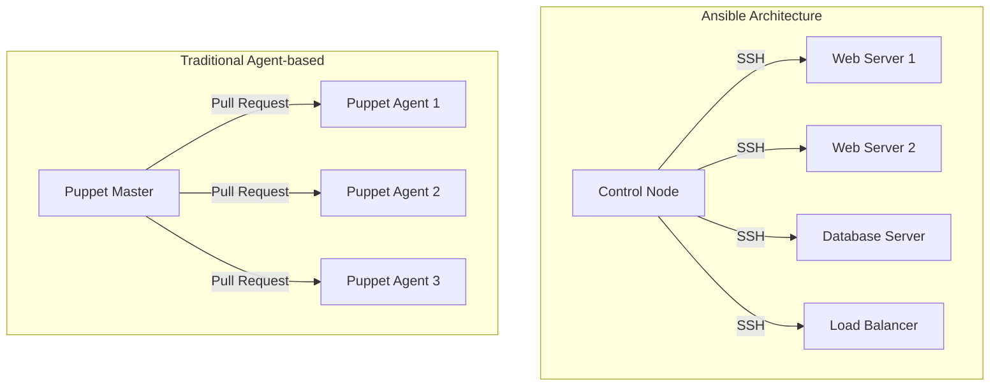
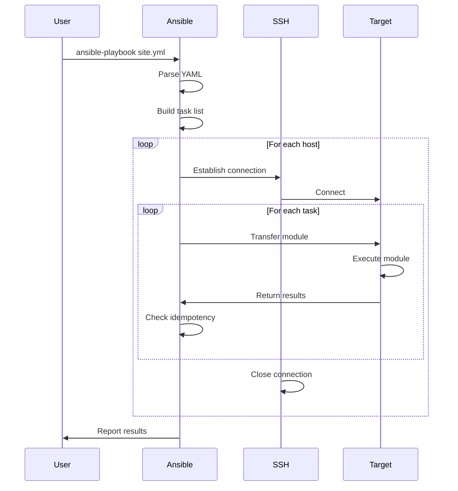
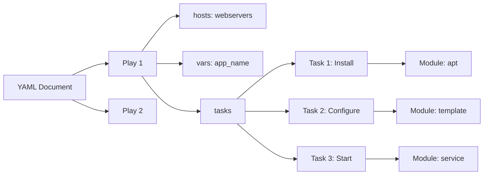
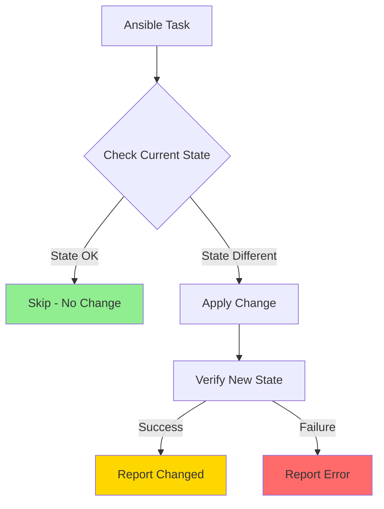
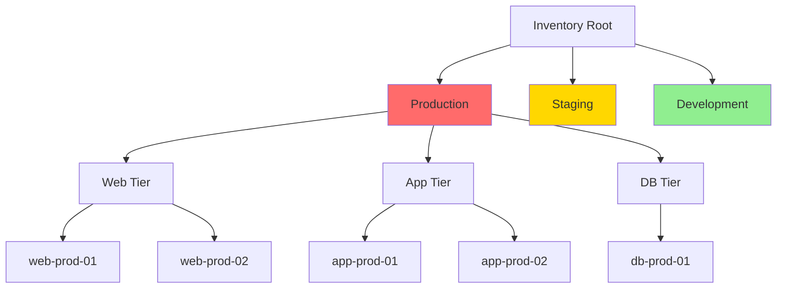

# Ansible süvakäsitlus

!!! tip "Navigeerimine"
    Kasuta paremal olevat sisukorda kiireks navigeerimiseks ↗️

Ansible'i agentless arhitektuur erineb fundamentaalselt teistest konfiguratsioonihalduse tööriistadest. Selle mõistmine on kriitiline, sest see mõjutab kõike - alates jõudlusest kuni turvalisuseni.

Traditsiooniline agent-põhine lähenemine nõuab iga hallatava süsteemi jaoks spetsiaalse tarkvara installimist. Puppet agent, Chef client, Salt minion - kõik need peavad töötama taustal, tarbima ressursse ja olema pidevalt ajakohased. Ansible'i SSH-põhine kommunikatsioon kasutab aga infrastruktuuri, mis juba eksisteerib igas Unix-põhises süsteemis.

| Aspekt | Ansible (Agentless) | Puppet/Chef (Agent-based) |
|--------|---------------------|---------------------------|
| Installatsioon | Ainult control node'il | Igal hallatav süsteemil |
| Ressursikasutus | Minimalne | Agent tarbib RAM/CPU |
| Turvalisus | SSH (standard protokoll) | Spetsiaalne agent port |
| Skaleeritavus | Paralleelne SSH | Agent pull interval |
| Võrguliiklus | Push-based | Pull-based |
| Offline töö | Võimalik | Piiratud |

SSH-protokoll pole juhuslik valik. See on kõige laialdasemalt kasutatav ja hästi testitud remote access protokoll enterprise keskkonnas. SSH võtmed on juba hallatud, port 22 on juba avatud, logid juba konfiguratsiooni jaoks olemas. Ansible lihtsalt kasutab seda, mis juba seal on.

## Playbook'i täitmise tsükkel

Arhitektuuri teine oluline aspekt on push vs pull mudel. Puppet ja Chef kasutavad pull mudelit - agendid küsivad regulaarselt serverilt, kas on midagi uut teha. Ansible kasutab push mudelit - käivitad playbook'i siis, kui tahad muudatust. See annab täpse kontrolli selle üle, millal ja kuidas muudatused rakendatakse.

## YAML kui konfiguratsioonikeel

YAML pole lihtsalt data formaat - see on konfiguratsioonikeel, mis peegeldab hirarhilisi seoseid viisil, mida JSON või XML ei suuda sama intuitiivselt edastada. Ansible'is muutub YAML struktuuri mõistmine eriti oluliseks, sest see määrab täitmise järjekorra ja konteksti.

| YAML Element | Ansible Kontekst | Näide |
|--------------|------------------|--------|
| Document | Playbook algus | `---` |
| List | Tasks, hosts, vars | `- name: Install nginx` |
| Dictionary | Task parameetrid | `apt: name=nginx state=present` |
| String | Väärtused | `name: "My task"` |
| Boolean | Flags | `become: yes` |
| Variable | Jinja2 template | `{{ ansible_hostname }}` |

YAML'i range taandrimise süsteem pole bürokraatia - see on funktsioon. Taandrimine määrab andmete hierarhia ja seeläbi ka Ansible'i käitumise. Vale taandrimine võib tähendada, et task käivitatakse vale host'i vastu või üldse vahele jäetakse.

## Moodulite ökosüsteem ja idempotentsus

Ansible'i jõud peitub selle laialdases moodulite kogumikus. Iga moodul pole lihtsalt funktsioon - see on abstraktsioon konkreetse tehnoloogia või süsteemi haldamiseks. Mooduli valik mõjutab otseselt seda, kui hooldatav ja turvalisne teie automatiseering on.

| Mooduli kategooria | Näited | Kasutusjuhud |
|-------------------|--------|--------------|
| System | `service`, `user`, `cron` | OS taseme haldus |
| Package | `apt`, `yum`, `pip` | Tarkvara installimine |
| File | `copy`, `template`, `lineinfile` | Failide haldus |
| Network | `uri`, `get_url`, `firewalld` | Võrgu konfigureerimine |
| Cloud | `ec2`, `azure_rm_*`, `gcp_*` | Pilve ressursid |
| Database | `mysql_user`, `postgresql_db` | Andmebaasi haldus |

Idempotentsus on Ansible'i südames. See tähendab, et sama playbook'i korduvad käivitamised ei muuda süsteemi olukorda, kui soovitud olek on juba saavutatud. See pole automaatne - iga moodul peab seda toetama oma loogikaga.

Idempotentse mooduli kirjutamine nõuab kolme sammu: kontrollida praegust olukorda, võrrelda soovitud olukorraga, ja muuta ainult vajadusel. Halvasti kirjutatud moodul võib iga käivitamisel midagi muuta, isegi kui pole vaja.

## Inventory haldamise strateegiad

Inventory pole lihtsalt hostide nimekiri - see on abstraktsioon teie infrastruktuuri kohta. Hästi disainitud inventory peegeldab teie organisatsiooni struktuuri ja muudab automatiseerimise intuitiivseks.

| Inventory tüüp | Struktuur | Sobivus |
|----------------|-----------|---------|
| Static (INI) | `[webservers]` | Väikesed, stabiilsed keskkonnad |
| Static (YAML) | Hierarhiline | Komplekssed grupid ja muutujad |
| Dynamic | Script/plugin | Pilve keskkonnad |
| Mixed | Static + dynamic | Hübriid infrastruktuur |

Grupi muutujad (`group_vars`) võimaldavad defineerida konfiguratsiooni, mis rakendub kõigile grupi liikmetele. Host muutujad (`host_vars`) alistavad grupi muutujad konkreetse hosti jaoks. See hierarhia loob paindliku süsteemi, kus saate määrata üldseid reegleid ja teha erandeid vajadusel.

Dynamic inventory muutub oluliseks pilve keskkonnas, kus serverid tulevad ja lähevad. AWS EC2 plugin võib automaatselt avastada instance'id, grupeerida neid tagide järgi ja pakkuda metadata't muutujatena. See tähendab, et teie Ansible kood töötab sõltumata sellest, mitu instance'i parasjagu töötab.
