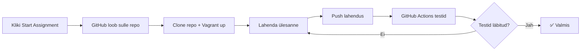

# 🎓 GitHub Classroom

## Automatiseeritud ülesanded infrastruktuuri halduseks

GitHub Classroom võimaldab automatiseerida DevOps ülesannete jagamist ja hindamist. Iga ülesanne on oma repositoorium koos automaatsete testidega.

## 📝 Aktiivsed ülesanded

### Nädal 9: Git & Versioonihaldus

**Eesmärk:** Rain Pickles veebilehe versioonihaldus

**Oskused:** 
- Git branching strategies
- Merge conflicts lahendamine
- Git workflow

**Tähtaeg:** 1 nädal

---

### Nädal 11-12: Docker Fundamentals

**Eesmärk:** Konteineriseeri veebirakendus

**Oskused:**
- Dockerfile loomine
- Multi-stage builds
- Docker Compose

**Tähtaeg:** 2 nädalat

---

### Nädal 13-15: Ansible Automation

**Eesmärk:** Automatiseeri LAMP stack deploy

**Oskused:**
- Ansible playbooks
- Roles ja Galaxy
- Inventory management

**Tähtaeg:** 3 nädalat

---

### Nädal 19: CI/CD Pipeline

**Eesmärk:** GitHub Actions CI/CD pipeline

**Oskused:**
- Automated testing
- Docker image build & push
- Deployment automation

**Tähtaeg:** 1 nädal

---

### Nädal 21: Kubernetes Deploy

**Eesmärk:** Deploy 3-tier app Kubernetes'isse

**Oskused:**
- K8s manifests (Deployment, Service, PVC)
- ConfigMaps & Secrets
- Ingress configuration

**Tähtaeg:** 1 nädal

---

### Nädal 23: Terraform Infrastructure

**Eesmärk:** Infrastructure as Code

**Oskused:**
- Terraform providers
- Resource management
- State management

**Tähtaeg:** 1 nädal

## 🔄 Töövoog

## 🎯 Hindamine

Iga ülesanne testib:
- **Funktsionaalsus:** 60% - Kas infrastruktuur töötab?
- **Best practices:** 20% - Kas järgitud parimaid praktikaid?
- **Dokumentatsioon:** 10% - README, kommentaarid
- **Idempotency:** 10% - Kas korduvkäivitus on turvaline?

## 🏠 Kodulabor

Soovituslik setup:
- Vagrant + VirtualBox
- Või Docker Desktop
- Või cloud (AWS Free Tier, Azure Student)

## ❓ KKK

??? question "Kas ma pean kasutama Vagrantit?"
    Ei, võid kasutada Docker'it, cloud'i või isegi füüsilisi masinaid.

??? question "Kuidas testida Ansible playbooke?"
    Kasuta `ansible-playbook --check` dry-run jaoks ja Molecule testimiseks.

??? question "Kas Kubernetes on kohustuslik?"
    Minikube või K3s on piisav. Pole vaja täis klastreid.
