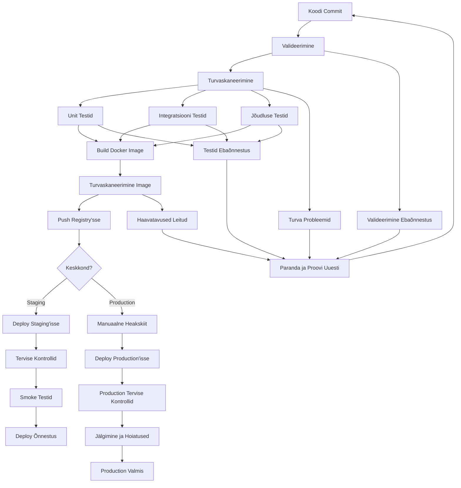

# CI/CD Advanced

!!! tip "Navigeerimine"
    Kasuta paremal olevat sisukorda kiireks navigeerimiseks ↗️

## Sissejuhatus

Selles peatükis tutvume ettevõtte-tasemel CI/CD automatiseerimisega, mis läheb palju kaugemale lihtsate "Hello World" pipeline'ide. Õpitakse, kuidas ehitada robustseid, turvalisi ja optimeeritud CI/CD süsteeme, mis suudavad toetada tõelist DevOps kultuuri.

> **Allikad ja viited:**
> - [Mastering GitLab CI/CD with Advanced Configuration Techniques](https://www.heyvaldemar.com/mastering-gitlab-ci-cd-with-advanced-configuration-techniques/)
> - [Advanced CI/CD Pipeline Configuration Strategies](https://dev.to/gauri1504/advanced-cicd-pipeline-configuration-strategies-4mjh)

***

## Ettevõtte DevOps Väljakutsed

### Tüüpilised probleemid suuremates projektides

- **Deployment käsitsi**: 2-4 tundi, kõrge vigade tõenäosus (30-40%)
- **Rollback keerukus**: 1-2 tundi, andmekadu risk
- **Deploy sagedus**: 1x nädalas või harvem
- **Arendajate stress**: Kõrge, öised deploy'id
- **Kvaliteedi kontroll**: Manuaalne, ebajärjekindel
- **Turvalisus**: Paroolid koodis, puuduvad turvaskaneerimised

### Legacy deployment protsess

| Samm   | Tegevus                                    | Riskid                              |
|--------|--------------------------------------------|-------------------------------------|
| 1      | SSH ühendus serverisse                      | Turvahaavatavus, üksik punkti rike |
| 2      | Git pull värske koodi saamiseks            | Konfliktid, vale branch             |
| 3      | Sõltuvuste käsitsi installeerimine         | Versioonikonfliktid                 |
| 4      | Rakenduse taaskäivitamine                    | Downtime, teenuse katkestus         |
| 5      | Manuaalne testimine                         | Inimviga, ebajärjekindel            |
| 6      | Kui midagi läheb valesti → rollback       | Andmekadu, pikk taastumisaeg        |

***

## Ettevõtte-tasemel Lahenduse Arhitektuur

### Põhiline DevOps Stack

| Tööriist          | Kirjeldus                                | Ettevõtte Eelised                           |
|-------------------|-----------------------------------------|----------------------------------------------|
| **Git (Version Control)** | Edasijõudnud harude strateegiad, koodikontroll | GitFlow/GitHub Flow, automatiseeritud kvaliteedi väravad |
| **GitLab CI/CD**  | Edasijõudnud pipeline konfiguratsioon          | Mitmeetapiline, paralleelne täitmine, turvaskaneerimine |
| **Docker**        | Konteineriseerimine mitmeetapiliste build'idega | Ühtsed keskkonnad, turvaskaneerimine   |
| **Terraform**     | Infrastruktur koodina                   | Multi-cloud, oleku haldus, drift detection |
| **Ansible**       | Konfiguratsiooni haldus                 | Idempotent, agentideta, inventuuri haldus  |
| **Prometheus + Grafana** | Jälgimine ja hoiatused                | SLO/SLI jälgimine, automatiseeritud incident response |
| **Vault**         | Saladuste haldus                       | Dünaamilised saladused, audit logimine, RBAC         |

***

## Edasijõudnud Git Workflow ja Harude Strateegia

### GitFlow Rakendamine

```bash
# Feature arendus
git checkout -b feature/user-authentication
git commit -m "Add OAuth2 integration"
git push origin feature/user-authentication

# Loo merge request kvaliteedi väravatega
# Automaatsed testid, turvaskaneerimised, koodikontroll kohustuslik
```

### Kvaliteedi Väravad

- **Koodikontroll**: Minimaalselt 2 heakskiitu vajalik
- **Automaatsed testid**: 100% läbimise määr kohustuslik
- **Turvaskaneerimine**: Ühtegi kõrge/kriitilist haavatavust
- **Jõudluse testid**: Vastuse aeg < 200ms
- **Katvus**: Minimaalselt 80% koodi katvus

***

## Edasijõudnud GitLab CI/CD Pipeline Arhitektuur

### Mitmeetapiline Pipeline Edasijõudnud Konfiguratsiooniga

See on **ettevõtte-tasemel GitLab CI/CD pipeline**, mis erineb tavalisest "Hello World" näitest mitme olulise aspekti poolest:

#### **Miks see on edasijõudnud?**

1. **Mitmeetapiline struktuur** - Pipeline on jagatud loogilisteks etappideks
2. **Turvalisus esikohal** - Iga etapp sisaldab turvakontrolli
3. **Paralleelne töötlemine** - Testid jooksevad samaaegselt
4. **Intelligentne caching** - Optimeeritud jõudlus
5. **Keskkonna-spetsiifiline loogika** - Erinevad reeglid erinevatele keskkondadele

```yaml
# .gitlab-ci.yml - Ettevõtte-tasemel konfiguratsioon
# 
# EDASIJÕUDNUD FUNKTSIOON 1: Mitmeetapiline struktuur
# Tavaline pipeline: build -> test -> deploy
# Meie pipeline: validate -> test -> security -> build -> deploy-staging -> deploy-production -> monitor
stages:
  - validate    # Koodi kvaliteedi kontroll
  - test        # Automaatsed testid
  - security    # Turvaskaneerimine
  - build       # Docker image loomine
  - deploy-staging    # Staging keskkonda deploy
  - deploy-production # Production keskkonda deploy
  - monitor     # Jälgimine ja tervise kontrollid

# EDASIJÕUDNUD FUNKTSIOON 2: Optimeeritud Docker konfiguratsioon
variables:
  DOCKER_DRIVER: overlay2        # Kiirem failisüsteem
  DOCKER_TLS_CERTDIR: "/certs"   # Turvaline TLS
  DOCKER_BUILDKIT: 1             # Uusim build tehnoloogia

# Globaalne konfiguratsioon - rakendub kõigile job'idele
default:
  image: docker:24.0.5
  services:
    - docker:24.0.5-dind  # Docker-in-Docker teenus
  before_script:
    - docker info
    - echo "Alustan pipeline'i $CI_COMMIT_REF_NAME jaoks"

# ETAPP 1: Valideerimine
# EDASIJÕUDNUD FUNKTSIOON 3: Tingimuslik täitmine
validate:
  stage: validate
  image: alpine:latest
  script:
    - apk add --no-cache git
    - git validate --strict  # Kontrollib koodi kvaliteeti
    - echo "Koodi valideerimine õnnestus"
  rules:
    # Jookseb ainult merge request'ide ja main branch'i jaoks
    - if: '$CI_PIPELINE_SOURCE == "merge_request_event"'
    - if: '$CI_COMMIT_BRANCH == "main"'

# ETAPP 2: Testimine
# EDASIJÕUDNUD FUNKTSIOON 4: Paralleelne testimine maatriks strateegiaga
test:unit:
  stage: test
  image: node:20-alpine
  script:
    - npm ci --cache .npm --prefer-offline  # Optimeeritud install
    - npm run test:unit
    - npm run test:coverage
  coverage: '/Lines\s*:\s*(\d+\.\d+)%/'  # Automaatne katvuse mõõtmine
  artifacts:
    reports:
      coverage_report:
        coverage_format: cobertura
        path: coverage/cobertura-coverage.xml
    paths:
      - coverage/
    expire_in: 1 week  # Artifaktid kustuvad automaatselt
  cache:
    key: ${CI_COMMIT_REF_SLUG}-npm  # Unikaalne cache võti
    paths:
      - .npm/
      - node_modules/
  parallel:
    matrix:
      # EDASIJÕUDNUD FUNKTSIOON 5: Testimine mitmes Node.js versioonis
      - NODE_VERSION: ["18", "20"]  # Jookseb paralleelselt mõlemas versioonis

# EDASIJÕUDNUD FUNKTSIOON 6: Integratsiooni testid teenustega
test:integration:
  stage: test
  image: python:3.11-slim
  services:
    - postgres:15-alpine  # Andmebaas teenus
    - redis:7-alpine      # Cache teenus
  variables:
    POSTGRES_DB: test_db
    POSTGRES_USER: test_user
    POSTGRES_PASSWORD: test_pass
  script:
    - pip install -r requirements.txt
    - pytest tests/integration/ -v --cov=app
  artifacts:
    when: always  # Salvestab tulemused isegi kui test ebaõnnestub
    paths:
      - test-results/
    reports:
      junit: test-results/junit.xml  # GitLab saab näha test tulemusi

# ETAPP 3: Turvalisus
# EDASIJÕUDNUD FUNKTSIOON 7: Põhjalik turvaskaneerimine
security:scan:
  stage: security
  image: securecodewarrior/docker-security-scan:latest
  script:
    - docker build -t $CI_REGISTRY_IMAGE:$CI_COMMIT_SHA .
    - docker run --rm -v /var/run/docker.sock:/var/run/docker.sock 
        securecodewarrior/docker-security-scan:latest 
        $CI_REGISTRY_IMAGE:$CI_COMMIT_SHA
  rules:
    - if: '$CI_COMMIT_BRANCH == "main"'
    - if: '$CI_PIPELINE_SOURCE == "merge_request_event"'

# ETAPP 4: Build
# EDASIJÕUDNUD FUNKTSIOON 8: Mitmeetapiline Docker build
build:
  stage: build
  image: docker:24.0.5
  services:
    - docker:24.0.5-dind
  script:
    - docker build 
        --build-arg BUILD_DATE=$(date -u +'%Y-%m-%dT%H:%M:%SZ')  # Build kuupäev
        --build-arg VCS_REF=$CI_COMMIT_SHA                       # Git commit hash
        --build-arg VERSION=$CI_COMMIT_TAG                       # Versiooni number
        -t $CI_REGISTRY_IMAGE:$CI_COMMIT_SHA                     # Unikaalne tag
        -t $CI_REGISTRY_IMAGE:latest                             # Latest tag
        .
    - docker push $CI_REGISTRY_IMAGE:$CI_COMMIT_SHA
    - docker push $CI_REGISTRY_IMAGE:latest
  rules:
    - if: '$CI_COMMIT_BRANCH == "main"'
    - if: '$CI_COMMIT_TAG'

# ETAPP 5: Staging Deploy
# EDASIJÕUDNUD FUNKTSIOON 9: Manuaalne heakskiit ja keskkonna haldus
deploy:staging:
  stage: deploy-staging
  image: alpine:latest
  environment:
    name: staging
    url: https://staging.techshop.com  # GitLab näitab keskkonna URL'i
  script:
    - apk add --no-cache curl
    - curl -X POST "$STAGING_WEBHOOK_URL" 
        -H "Authorization: Bearer $STAGING_DEPLOY_TOKEN"
        -d '{"image": "'$CI_REGISTRY_IMAGE:$CI_COMMIT_SHA'"}'
    - echo "Staging deployment käivitatud"
  rules:
    - if: '$CI_COMMIT_BRANCH == "main"'
  when: manual        # EDASIJÕUDNUD: Nõuab manuaalset heakskiitu
  allow_failure: false # EDASIJÕUDNUD: Ebaõnnestumine peatab pipeline'i

# ETAPP 6: Production Deploy
# EDASIJÕUDNUD FUNKTSIOON 10: Tag-based deployment
deploy:production:
  stage: deploy-production
  image: alpine:latest
  environment:
    name: production
    url: https://techshop.com
  script:
    - apk add --no-cache curl
    - curl -X POST "$PROD_WEBHOOK_URL" 
        -H "Authorization: Bearer $PROD_DEPLOY_TOKEN"
        -d '{"image": "'$CI_REGISTRY_IMAGE:$CI_COMMIT_SHA'"}'
    - echo "Production deployment käivitatud"
  rules:
    # EDASIJÕUDNUD: Jookseb ainult versiooni tag'idega (nt v1.2.3)
    - if: '$CI_COMMIT_TAG =~ /^v\d+\.\d+\.\d+$/'
  when: manual
  allow_failure: false

# ETAPP 7: Jälgimine
# EDASIJÕUDNUD FUNKTSIOON 11: Post-deployment tervise kontrollid
monitor:health:
  stage: monitor
  image: curlimages/curl:latest
  script:
    - curl -f $STAGING_URL/health || exit 1    # Tervise endpoint
    - curl -f $STAGING_URL/metrics || exit 1   # Meetrikate endpoint
    - echo "Tervise kontrollid õnnestusid"
  rules:
    - if: '$CI_COMMIT_BRANCH == "main"'
  needs:
    - deploy:staging  # EDASIJÕUDNUD: Ootab staging deploy'i lõppu
```

> **Allikas**: [GitLab CI/CD Advanced Configuration](https://www.heyvaldemar.com/mastering-gitlab-ci-cd-with-advanced-configuration-techniques/)

### Edasijõudnud Pipeline Funktsioonid

#### 1. **Modulaarne Konfiguratsioon Include'idega**

**Miks see on edasijõudnud?**
- **Korduvkasutatavus**: Sama konfiguratsiooni saab kasutada mitmes projektis
- **Hooldatavus**: Iga funktsioon on eraldi failis
- **Testitavus**: Saab testida üksikuid komponente
- **Jagamine**: Meeskond saab jagada konfiguratsioone

```yaml
# .gitlab-ci.yml (põhifail)
# EDASIJÕUDNUD: Modulaarne struktuur - jagame pipeline'i väiksemateks osadeks
include:
  - local: '.gitlab-ci/build.yml'      # Build loogika eraldi failis
  - local: '.gitlab-ci/test.yml'       # Test loogika eraldi failis
  - local: '.gitlab-ci/deploy.yml'     # Deploy loogika eraldi failis
  - project: 'devops/shared-templates' # Jagatud mallid teisest projektist
    file: '/security-scan.yml'
    ref: 'main'

variables:
  GLOBAL_VAR: "shared-value"  # Globaalsed muutujad kõigile job'idele
```

#### 2. **Dünaamilised Muutujad ja Tingimuslik Loogika**

**Miks see on edasijõudnud?**
- **Automaatne keskkonna tuvastamine**: Pipeline ise otsustab, kuhu deploy'ida
- **Vigade vähendamine**: Ei pea käsitsi keskkonda valima
- **Paindlikkus**: Üks konfiguratsioon töötab kõigis keskkondades

```yaml
# EDASIJÕUDNUD: Dünaamiline keskkonna konfiguratsioon
deploy:
  stage: deploy
  variables:
    # EDASIJÕUDNUD FUNKTSIOON: Automaatne keskkonna tuvastamine
    # Kui branch on "main" -> production, muidu -> staging
    ENVIRONMENT: $([ "$CI_COMMIT_BRANCH" == "main" ] && echo "production" || echo "staging")
    
    # EDASIJÕUDNUD FUNKTSIOON: Dünaamiline URL valik
    # Valib õige URL'i vastavalt keskkonnale
    DEPLOY_URL: $([ "$CI_COMMIT_BRANCH" == "main" ] && echo "$PROD_URL" || echo "$STAGING_URL")
  script:
    - echo "Deploying to $ENVIRONMENT at $DEPLOY_URL"
    - ./scripts/deploy.sh $ENVIRONMENT
```

#### 3. **Edasijõudnud Caching Strateegiad**

**Miks see on edasijõudnud?**
- **Kiirus**: Cache'itud sõltuvused = kiiremad build'id
- **Kulude kokkuhoid**: Vähem ressursse kulutatakse
- **Intelligentne cache**: Cache muutub ainult siis, kui sõltuvused muutuvad

```yaml
# EDASIJÕUDNUD: Optimeeritud caching erinevate job'ide jaoks
cache:
  key: 
    files:
      - package-lock.json    # Kui package-lock.json muutub, cache uueneb
      - requirements.txt     # Kui requirements.txt muutub, cache uueneb
  paths:
    - node_modules/          # Node.js sõltuvused
    - .npm/                  # npm cache
    - venv/                  # Python virtuaalne keskkond
  policy: pull-push          # Laeb cache'i ja salvestab uue

# EDASIJÕUDNUD: Job-spetsiifiline cache override
test:unit:
  cache:
    key: ${CI_COMMIT_REF_SLUG}-test  # Unikaalne cache võti test'ide jaoks
    paths:
      - test-results/        # Test tulemused
    policy: pull             # Ainult laeb cache'i, ei salvesta
```

> **Allikas**: [Advanced CI/CD Pipeline Configuration Strategies](https://dev.to/gauri1504/advanced-cicd-pipeline-configuration-strategies-4mjh)

***

## Edasijõudnud Docker Konfiguratsioon

### Mitmeetapiline Dockerfile Turvalisusega

**Miks see on edasijõudnud?**
- **Turvalisus**: Kasutab mitte-root kasutajat
- **Optimeeritud suurus**: Ainult vajalikud failid lõplikus image'is
- **Tervise kontrollid**: Automaatne kontroll, kas rakendus töötab
- **Parimad praktikad**: Järgib Docker turvalisuse soovitusi

```dockerfile
# EDASIJÕUDNUD: Mitmeetapiline build tootmise optimeerimiseks
# 
# ETAPP 1: Build etapp - siin kompileeritakse ja ehitatakse
FROM node:20-alpine AS builder

# EDASIJÕUDNUD FUNKTSIOON 1: Turvalisus - kasuta mitte-root kasutajat
# Tavaline Docker: kasutab root kasutajat (ohtlik!)
# Meie lahendus: loob spetsiaalse kasutaja
RUN addgroup -g 1001 -S nodejs
RUN adduser -S nextjs -u 1001

WORKDIR /app
COPY package*.json ./
# EDASIJÕUDNUD FUNKTSIOON 2: Optimeeritud install
RUN npm ci --only=production && npm cache clean --force

# ETAPP 2: Runtime etapp - siin jookseb rakendus
FROM node:20-alpine AS runner
WORKDIR /app

# EDASIJÕUDNUD FUNKTSIOON 3: Turvaline kopeerimine õige omandiõigustega
# Kopeerib ainult vajalikud failid builder'ist
COPY --from=builder --chown=nextjs:nodejs /app/node_modules ./node_modules
COPY --chown=nextjs:nodejs . .

# EDASIJÕUDNUD FUNKTSIOON 4: Turvalisus - lülitu mitte-root kasutajale
USER nextjs

EXPOSE 3000
ENV PORT 3000

# EDASIJÕUDNUD FUNKTSIOON 5: Automaatne tervise kontroll
# Kontrollib iga 30 sekundi järel, kas rakendus töötab
HEALTHCHECK --interval=30s --timeout=3s --start-period=5s --retries=3 \
  CMD curl -f http://localhost:3000/health || exit 1

CMD ["npm", "start"]
```

**Miks mitmeetapiline build on parem?**
- **Väiksem image**: Ainult runtime failid, mitte build tööriistad
- **Kiirem start**: Vähem failisid = kiirem container käivitumine
- **Turvalisem**: Vähem haavatavusi, kuna build tööriistad puuduvad

### Docker Turvaskaneerimine

**Miks see on edasijõudnud?**
- **Automaatne skaneerimine**: Iga Docker image skaneeritakse automaatselt
- **Mitme tööriista kasutamine**: Trivy + SecureCodeWarrior = põhjalikum kontroll
- **Integratsioon pipeline'iga**: Turvaskaneerimine on osa CI/CD protsessist
- **Vigade ennetamine**: Leidab haavatavusi enne production'i

```yaml
# EDASIJÕUDNUD: Turvaskaneerimine pipeline'is
security:docker:
  stage: security
  image: docker:latest
  services:
    - docker:dind  # Docker-in-Docker teenus
  script:
    # ETAPP 1: Ehita Docker image
    - docker build -t $CI_REGISTRY_IMAGE:$CI_COMMIT_SHA .
    
    # ETAPP 2: Trivy skaneerimine - leiab haavatavusi
    # EDASIJÕUDNUD FUNKTSIOON: Põhjalik haavatavuste analüüs
    - docker run --rm -v /var/run/docker.sock:/var/run/docker.sock 
        aquasec/trivy image $CI_REGISTRY_IMAGE:$CI_COMMIT_SHA
    
    # ETAPP 3: SecureCodeWarrior skaneerimine - täiendav turvakontroll
    # EDASIJÕUDNUD FUNKTSIOON: Mitme tööriista kasutamine
    - docker run --rm -v /var/run/docker.sock:/var/run/docker.sock 
        securecodewarrior/docker-security-scan:latest 
        $CI_REGISTRY_IMAGE:$CI_COMMIT_SHA
```

**Miks kasutada mitut turvaskaneerimise tööriista?**
- **Trivy**: Leiab teadaolevad haavatavused (CVE)
- **SecureCodeWarrior**: Leiab konfiguratsiooni probleeme
- **Kombineeritud tulemus**: Põhjalikum turvakontroll

> **Allikas**: [Docker Security Best Practices](https://www.heyvaldemar.com/mastering-gitlab-ci-cd-with-advanced-configuration-techniques/)

***

## Infrastruktur Koodina Terraform'iga

### Edasijõudnud Terraform Konfiguratsioon

**Miks see on edasijõudnud?**
- **Oleku haldus**: S3 backend + DynamoDB lukustamine
- **Modulaarne struktuur**: Kasutab AWS mooduleid
- **Automaatne skaleerimine**: ECS automaatne skaleerimine
- **Turvalisus**: VPC privaatsed ja avalikud subnet'id
- **Tagimine**: Automaatne ressursside tagimine

```hcl
# terraform/main.tf
# EDASIJÕUDNUD FUNKTSIOON 1: Versiooni kontroll ja provider'ite haldus
terraform {
  required_version = ">= 1.0"  # Tagab uusima Terraform versiooni
  required_providers {
    aws = {
      source  = "hashicorp/aws"
      version = "~> 5.0"  # Uusim AWS provider
    }
  }
  
  # EDASIJÕUDNUD FUNKTSIOON 2: Remote state haldus
  backend "s3" {
    bucket         = "techshop-terraform-state"  # State faili asukoht
    key            = "production/terraform.tfstate"
    region         = "eu-west-1"
    encrypt        = true                        # Krüpteeritud state
    dynamodb_table = "terraform-locks"           # Lukustamine paralleelsete muudatuste vastu
  }
}

# EDASIJÕUDNUD FUNKTSIOON 3: Keskkonna-spetsiifiline konfiguratsioon
locals {
  environment = terraform.workspace  # Automaatne keskkonna tuvastamine
  common_tags = {
    Project     = "TechShop"
    Environment = local.environment
    ManagedBy   = "Terraform"
    Owner       = "DevOps Team"
  }
}

# EDASIJÕUDNUD FUNKTSIOON 4: VPC turvalisuse parimate praktikatega
module "vpc" {
  source = "terraform-aws-modules/vpc/aws"  # Kasutab testitud AWS moodulit
  
  name = "techshop-${local.environment}"
  cidr = var.vpc_cidr
  
  # EDASIJÕUDNUD: Mitme availability zone kasutamine
  azs             = ["${var.aws_region}a", "${var.aws_region}b"]
  private_subnets = var.private_subnet_cidrs  # Privaatsed subnet'id (andmebaasid)
  public_subnets  = var.public_subnet_cidrs   # Avalikud subnet'id (load balancer'id)
  
  enable_nat_gateway = true   # NAT gateway privaatsete subnet'ide jaoks
  enable_vpn_gateway = false  # VPN ei ole vajalik
  
  tags = local.common_tags
}

# EDASIJÕUDNUD FUNKTSIOON 5: ECS Cluster automaatse skaleerimisega
resource "aws_ecs_cluster" "main" {
  name = "techshop-${local.environment}"
  
  setting {
    name  = "containerInsights"  # Põhjalik container jälgimine
    value = "enabled"
  }
  
  tags = local.common_tags
}

# EDASIJÕUDNUD FUNKTSIOON 6: Automaatse skaleerimise konfiguratsioon
resource "aws_appautoscaling_target" "ecs_target" {
  max_capacity       = 10  # Maksimaalne container'ite arv
  min_capacity       = 2   # Minimaalne container'ite arv
  resource_id        = "service/${aws_ecs_cluster.main.name}/${aws_ecs_service.main.name}"
  scalable_dimension = "ecs:service:DesiredCount"
  service_namespace  = "ecs"
}
```

**Miks see on ettevõtte-tasemel?**
- **Oleku haldus**: Remote state + lukustamine = meeskonna töö
- **Modulaarsus**: AWS moodulid = testitud ja hooldatud kood
- **Skaleeritavus**: Automaatne skaleerimine vastavalt koormusele
- **Turvalisus**: VPC eraldamine ja NAT gateway

> **Allikas**: [Terraform Best Practices](https://dev.to/gauri1504/advanced-cicd-pipeline-configuration-strategies-4mjh)

***

## Edasijõudnud CI/CD Pipeline Voo



> **Allikas**: [CI/CD Pipeline Design Patterns](https://www.heyvaldemar.com/mastering-gitlab-ci-cd-with-advanced-configuration-techniques/)

***

## Turvalisus-Esikohal CI/CD Rakendamine

### Saladuste Haldus

```yaml
# Ära kunagi hardcode'i saladusi - kasuta GitLab CI/CD muutujaid
variables:
  # Need on seadistatud GitLab UI's Settings > CI/CD > Variables
  AWS_ACCESS_KEY_ID: $AWS_ACCESS_KEY_ID
  AWS_SECRET_ACCESS_KEY: $AWS_SECRET_ACCESS_KEY
  DATABASE_PASSWORD: $DATABASE_PASSWORD
  API_SECRET_KEY: $API_SECRET_KEY

# Kasuta kaitstud muutujaid tootmise jaoks
deploy:production:
  variables:
    ENVIRONMENT: "production"
  script:
    - echo "Deploying with secure credentials"
    - ./scripts/deploy.sh
  only:
    variables:
      - $CI_COMMIT_TAG
```

### Turvaskaneerimise Pipeline

```yaml
# Põhjalik turvaskaneerimine
security:comprehensive:
  stage: security
  image: securecodewarrior/security-scan:latest
  script:
    # SAST - Static Application Security Testing
    - semgrep --config=auto .
    - bandit -r . -f json -o bandit-report.json
    
    # Sõltuvuste skaneerimine
    - safety check --json --output safety-report.json
    - npm audit --audit-level moderate
    
    # Konteineri turvalisus
    - trivy image --severity HIGH,CRITICAL $CI_REGISTRY_IMAGE:$CI_COMMIT_SHA
    
    # Infrastruktuuri turvalisus
    - checkov -d terraform/ --framework terraform
  artifacts:
    reports:
      sast: bandit-report.json
      dependency_scanning: safety-report.json
    paths:
      - security-reports/
    expire_in: 1 week
  allow_failure: false
```

> **Allikas**: [Security-First CI/CD Practices](https://www.heyvaldemar.com/mastering-gitlab-ci-cd-with-advanced-configuration-techniques/)

***

## Jõudluse Optimeerimise Strateegiad

### Pipeline Optimeerimise Tehnikad

```yaml
# Paralleelne täitmine kiiremate pipeline'ide jaoks
test:parallel:
  stage: test
  parallel:
    matrix:
      - TEST_SUITE: ["unit", "integration", "e2e"]
      - NODE_VERSION: ["18", "20"]
  script:
    - npm run test:$TEST_SUITE
  cache:
    key: ${CI_COMMIT_REF_SLUG}-${TEST_SUITE}
    paths:
      - node_modules/
      - test-results/

# Optimeeritud Docker build'id BuildKit'iga
build:optimized:
  stage: build
  variables:
    DOCKER_BUILDKIT: 1
    BUILDKIT_PROGRESS: plain
  script:
    - docker build 
        --cache-from $CI_REGISTRY_IMAGE:cache
        --cache-to $CI_REGISTRY_IMAGE:cache
        --target production
        -t $CI_REGISTRY_IMAGE:$CI_COMMIT_SHA
        .
```

### Edasijõudnud Caching Strateegiad

```yaml
# Mitmetasemeline caching
cache:
  key: 
    files:
      - package-lock.json
      - requirements.txt
      - Dockerfile
  paths:
    - node_modules/
    - .npm/
    - venv/
    - .cache/
  policy: pull-push

# Job-spetsiifiline cache optimeerimine
test:unit:
  cache:
    key: ${CI_COMMIT_REF_SLUG}-test
    paths:
      - test-results/
      - coverage/
    policy: pull
```

> **Allikas**: [Pipeline Performance Optimization](https://dev.to/gauri1504/advanced-cicd-pipeline-configuration-strategies-4mjh)

***

## Jälgimine ja Jälgitavus

### Rakenduse Jõudluse Jälgimine

```yaml
# Post-deployment jälgimine
monitor:deployment:
  stage: monitor
  image: curlimages/curl:latest
  script:
    # Tervise kontrollid
    - curl -f $DEPLOY_URL/health || exit 1
    - curl -f $DEPLOY_URL/ready || exit 1
    
    # Jõudluse kontrollid
    - response_time=$(curl -o /dev/null -s -w '%{time_total}' $DEPLOY_URL)
    - if (( $(echo "$response_time > 2.0" | bc -l) )); then exit 1; fi
    
    # Meetrikate valideerimine
    - curl -f $DEPLOY_URL/metrics | grep -q "http_requests_total"
    
    echo "Kõik jälgimise kontrollid õnnestusid"
  rules:
    - if: '$CI_COMMIT_BRANCH == "main"'
  needs:
    - deploy:staging
```

### Prometheus ja Grafana Integratsioon

```yaml
# Meetrikate kogumise töö
collect:metrics:
  stage: monitor
  image: prom/prometheus:latest
  script:
    - promtool check config /etc/prometheus/prometheus.yml
    - curl -X POST http://prometheus:9090/-/reload
  variables:
    PROMETHEUS_URL: "http://prometheus:9090"
```

> **Allikas**: [DevOps Monitoring Best Practices](https://www.heyvaldemar.com/mastering-gitlab-ci-cd-with-advanced-configuration-techniques/)

***

## Tulemused: Enne vs Pärast Rakendamist

| Näitaja                    | Enne (Käsitsi)    | Pärast (Automatiseeritud)  | Paranemine        |
|---------------------------|-------------------|-------------------|-------------------|
| **Deployment Aeg**       | 2-4 tundi         | 5-10 minutit      | 95% kiirem         |
| **Vigade Määr**            | 30-40%            | 2-5%              | 85% vähenemine      |
| **Rollback Aeg**         | 1-2 tundi         | 2-5 minutit       | 95% kiirem         |
| **Deployment Sagedus**  | 1x nädalas       | 5-10x päevas     | 10x suurenemine       |
| **Arendajate Stress**      | Kõrge              | Madal               | Oluline leevendus |
| **Turva Haavatavused** | Käsitsi, ebajärjekindel | Automatiseeritud skaneerimine | 100% katvus      |
| **Infrastruktuuri Drift**  | Tavaline            | Elimineeritud        | 100% järjepidevus   |
| **Keskmine Taastumisaeg** | 2-4 tundi         | 15-30 minutit     | 90% paranemine    |

> **Allikas**: [DevOps Transformation Metrics](https://www.heyvaldemar.com/mastering-gitlab-ci-cd-with-advanced-configuration-techniques/)

***

## Production Troubleshooting: Advanced Scenarios

### Scenario 1: 502 Bad Gateway Error

| Step | Command/Action | Purpose |
|------|----------------|---------|
| **Pipeline Check** | `gitlab-ci-lint .gitlab-ci.yml` | Validate CI configuration |
| **Container Status** | `docker ps`, `docker logs techshop-app` | Check container health |
| **Load Balancer** | `kubectl get svc`, `kubectl describe svc` | Verify service endpoints |
| **Database Connection** | `mysql -h db.techshop.com -u user -p` | Test database connectivity |
| **Network Policies** | `kubectl get networkpolicies` | Check security rules |
| **Resource Limits** | `kubectl top pods`, `kubectl describe pod` | Verify resource constraints |
| **Solution** | Update Terraform config, redeploy with Ansible | Fix and restore service |

### Scenario 2: Performance Degradation

| Step | Command/Action | Purpose |
|------|----------------|---------|
| **Metrics Check** | `curl $PROMETHEUS_URL/api/v1/query?query=response_time` | Analyze performance metrics |
| **Log Analysis** | `kubectl logs -f deployment/techshop-app` | Identify bottlenecks |
| **Resource Usage** | `kubectl top nodes`, `kubectl top pods` | Check resource utilization |
| **Auto-scaling** | `kubectl get hpa`, `kubectl describe hpa` | Verify scaling behavior |
| **Database Performance** | `mysql -e "SHOW PROCESSLIST"` | Check database queries |
| **Solution** | Scale resources, optimize queries, update HPA | Restore performance |

### Scenario 3: Security Incident Response

| Step | Command/Action | Purpose |
|------|----------------|---------|
| **Threat Detection** | Check security scan reports, SIEM alerts | Identify security issues |
| **Container Scan** | `trivy image techshop:latest` | Scan for vulnerabilities |
| **Network Analysis** | `kubectl get networkpolicies`, `kubectl logs` | Check network traffic |
| **Access Review** | Review RBAC policies, audit logs | Verify access controls |
| **Incident Response** | Isolate affected systems, patch vulnerabilities | Contain and remediate |
| **Post-Incident** | Update security policies, improve monitoring | Prevent future incidents |

***

## Reaalne Näide: Ettevõtte-tasemel CI/CD Automatiseerimine

### "Deployment Machine" - Null-Downtime, Auto-Healing Süsteem

See on põhjalik näide, kuidas üks ettevõte ehitas täielikult automatiseeritud, turvalise ja null-downtime deployment süsteemi. See näitab, kuidas kõik edasijõudnud tehnikad töötavad koos reaalses keskkonnas.

> **Allikas**: [The CI/CD Pipeline Upgrade That Took Our Deploys From Stressful to Effortless](https://medium.com/@sonal.sadafal/the-ci-cd-pipeline-upgrade-that-took-our-deploys-from-stressful-to-effortless-b0fe1c03777c)

#### **Probleem vs Eesmärk**

**Probleem:**
- Deployment'id olid riskantsed, manuaalsed, öösel tehtavad ja läbipaistmatud
- Kõrge vigade tõenäosus
- Pikk taastumisaeg probleemide korral

**Eesmärk:**
- Kiire ja turvaline tarnimine
- Null-downtime release'id
- Kohene rollback
- Sisseehitatud turvalisus
- Rikas jälgitavus

#### **10 Põhilist Komponenti**

**1. Nutikas Branching ja Kiire Tagasiside**

```yaml
# EDASIJÕUDNUD: Väikeste muudatuste strateegia
branching_strategy:
  type: "trunk-based"
  max_pr_size: "300 rida"
  required_reviews: 2
  status_checks:
    - lint
    - unit_tests
    - sast
    - secrets_scan
  conventional_commits: true  # feat:, fix: → automaatne versioneerimine
```

**2. Supply Chain Turvalisus (CI-sse sisse ehitatud)**

```yaml
# EDASIJÕUDNUD: Täielik turvalisuse kontroll
security_pipeline:
  sbom:
    tool: "CycloneDX"
    action: "produce_on_every_build"
    attach_as: "artifact_and_label"
  
  image_signing:
    tool: "Cosign"
    policy: "only_signed_images_in_cluster"
  
  vulnerability_scan:
    tools: ["Trivy", "Grype"]
    fail_on: "Critical/High"
    allowlist: "time_bound"
  
  provenance:
    tool: "SLSA_attestation"
    store_with: "image"
```

**3. Efemeersed Preview Keskkonnad**

```yaml
# EDASIJÕUDNUD: Iga PR jaoks automaatne keskkond
preview_environments:
  trigger: "on_pr_creation"
  process:
    - create_namespace
    - deploy_with_helm_kustomize
    - run_smoke_and_contract_tests
    - post_url_to_pr
    - auto_destroy_on_close
  data:
    seed_with: "masked_test_data"
    disable: "external_callbacks"
```

**4. GitOps CD (Deklaratiivne, Audititav)**

```yaml
# EDASIJÕUDNUD: Git kui tõe allikas
gitops_setup:
  repositories:
    app_repo: "code"
    env_repo: "manifests"
  
  process:
    ci_updates: "image_tag_in_env_repo"
    argo_cd_syncs: "clusters_to_env_repo_state"
    drift_detection: "alerts_enabled"
  
  rollback: "git_revert"
```

**5. Progressiivne Tarnimine (Argo Rollouts)**

```yaml
# EDASIJÕUDNUD: Canary deployment strateegia
progressive_delivery:
  tool: "Argo_Rollouts"
  canary_plan:
    steps:
      - "5% → pause(5m)"
      - "25% → pause(10m)" 
      - "50% → pause(10m)"
      - "100%"
  
  automated_analysis:
    metrics_source: "Prometheus/Datadog"
    check_metrics:
      - "error_rate_5xx"
      - "p95_latency"
      - "resource_saturation"
      - "business_kpi_checkout_success"
    
    promotion_conditions:
      score: "≥ threshold for N intervals"
    
    auto_rollback:
      trigger: "error_rate >1% for 2 consecutive intervals"
```

**6. Post-Deploy Kvaliteedi Väravad**

```yaml
# EDASIJÕUDNUD: "Deploy õnnestus" ≠ "see on hea"
post_deploy_quality:
  dast:
    tool: "ZAP"
    environment: "staging"
  
  e2e_tests:
    tools: ["Playwright", "Cypress"]
    type: "smoke_post_release"
  
  load_tests:
    tool: "k6"
    schedule: "off_peak"
    compare_to: "SLO_budgets"
```

**7. Governance ja Policy-as-Code**

```yaml
# EDASIJÕUDNUD: Compliance ilma inimeste ummikute
governance:
  policy_engines: ["Kyverno", "OPA_Gatekeeper"]
  
  rules:
    - "enforce_resource_limits_requests"
    - "block_privileged_hostpath"
    - "require_image_signature_sbom_labels"
  
  infrastructure:
    tool: "Terraform"
    cost_analysis: "Infracost_comments_on_MR"
```

**8. Observability Esikohal (OTel + SLOs)**

```yaml
# EDASIJÕUDNUD: Kui sa ei näe, ei saa õigeaegselt rollback'ida
observability:
  instrumentation: "OpenTelemetry"
  data_types: ["traces", "metrics", "logs"]
  
  slos:
    - "availability"
    - "latency_p95"
    - "error_rate"
    - "error_budget"
  
  release_dashboards:
    show: "canary_vs_stable_metrics"
    display: "rollout_step_aca_score"
```

**9. Resilientsus ja Andmete Turvalisus**

```yaml
# EDASIJÕUDNUD: Enamik "halbu deploy'e" on andmeprobleemid
resilience:
  db_migrations:
    pattern: "expand_contract"
    requirement: "backward_compatible_reads"
  
  feature_flags:
    tools: ["LaunchDarkly", "OpenFeature"]
    use_cases: ["kill_switches", "gradual_exposure"]
  
  chaos_testing:
    schedule: "nightly_smoke_non_prod"
    tests: ["pod_kill", "node_drain"]
    verify: "self_heal_works"
```

**10. Saladuste ja Juurdepääsu Haldus**

```yaml
# EDASIJÕUDNUD: Vähim privileeg ja audititavad muudatused
secrets_management:
  workload_identity: "OIDC_for_CI_to_cluster"
  external_secrets: "AWS_Secrets_Manager_HashiCorp_Vault"
  csi_driver: "secrets_to_pods"
  rotation: "no_long_lived_tokens_in_CI"
```

#### **Konkreetne Roll-Forward/Rollback Loogika**

```yaml
# EDASIJÕUDNUD: Kopeeritav loogika
promotion_logic:
  promote_when:
    - "last_3_analysis_intervals_pass"
    - "no_paging_alerts"
    - "business_kPI_within_±2%_baseline"
  
  rollback_when:
    - "error_rate >1% for 2 intervals"
    - "p95 > SLO+20%"
    - "crashloop ≥ N"
  
  freeze:
    trigger: "auto_change_freeze_on_incident_SEV-2+"
    until: "postmortem_actions_merged"
```

#### **Tüüpilised Probleemid ja Lahendused**

| Probleem | Lahendus |
|----------|----------|
| **Aeglane CI (>15 min)** | Jagatud job'id, test maatriks selektiivselt, cache sõltuvused, shard testid |
| **Ebakindlad testid** | Karantiin + öösel; ära blokeeri release'e teadaolevate flake'ide tõttu |
| **Policy müra** | Alusta "audit" režiimis; edenda "enforce" režiimi reegli kaupa |
| **Canary valepositiivid** | Pikenda intervalli, stabiliseeri meetrikad, soenda cache'id |
| **DB ühildumatus** | Kohusta tagasiühilduvaid deploy'e; kui mitte, siis Blue/Green |

#### **Minimaalne Adoptsiooni Plaan (4 Sprint'i)**

```yaml
# EDASIJÕUDNUD: Samm-sammult rakendamine
sprint_1:
  focus: "Harden CI"
  tasks:
    - "SAST, secrets scan, SBOM, signing"
    - "Target: 10-min CI"

sprint_2:
  focus: "Argo CD + env repo"
  tasks:
    - "Basic deploys"
    - "SLOs defined"

sprint_3:
  focus: "Argo Rollouts canary"
  tasks:
    - "Prometheus checks"
    - "Slack notifications"

sprint_4:
  focus: "Policy enforcement"
  tasks:
    - "Signed images, resources"
    - "Preview envs on PRs"
```

#### **Mõõdetavad Näitajad (Exec Dashboard)**

- **Lead time for changes** - muudatuste aeg
- **Deployment frequency** - deployment'ide sagedus  
- **Change failure rate** - muudatuste ebaõnnestumise määr
- **MTTR** - keskmine taastumisaeg
- **Error budget burn** - vea eelarve põletamine
- **% auto-rollbacks vs manual** - automaatse vs manuaalse rollback'i suhe
- **Cost per release** - kulud release'i kohta

> **Allikas**: [Advanced CI/CD Pipeline Case Study](https://medium.com/@sonal.sadafal/the-ci-cd-pipeline-upgrade-that-took-our-deploys-from-stressful-to-effortless-b0fe1c03777c)

***

## Edasijõudnud Automatiseerimise Projektide Struktuur

### Ettevõtte-tasemel DevOps Projekt

Loo põhjalik automatiseerimise projekt järgmise ettevõtte-tasemel struktuuriga:

```text
techshop-enterprise-devops/
├── infrastructure/
│   ├── terraform/
│   │   ├── environments/
│   │   │   ├── staging/
│   │   │   └── production/
│   │   ├── modules/
│   │   └── state/
│   └── ansible/
│       ├── playbooks/
│       ├── roles/
│       └── inventory/
├── applications/
│   ├── frontend/
│   │   ├── Dockerfile
│   │   └── .gitlab-ci.yml
│   ├── backend/
│   │   ├── Dockerfile
│   │   └── .gitlab-ci.yml
│   └── shared/
├── ci-cd/
│   ├── .gitlab-ci/
│   │   ├── build.yml
│   │   ├── test.yml
│   │   ├── security.yml
│   │   └── deploy.yml
│   └── scripts/
├── monitoring/
│   ├── prometheus/
│   ├── grafana/
│   └── alertmanager/
├── security/
│   ├── policies/
│   ├── scans/
│   └── compliance/
├── documentation/
│   ├── architecture/
│   ├── runbooks/
│   └── troubleshooting/
└── README.md
```

### Põhilised Automatiseerimise Oskused

**Tehnilised Oskused:**

- **Edasijõudnud GitLab CI/CD**: Mitmeetapilised pipeline'id, paralleelne täitmine, turvaskaneerimine
- **Konteineri Orkestreerimine**: Docker, Kubernetes, Helm chart'id
- **Infrastruktur Koodina**: Terraform, Ansible, CloudFormation
- **Turvalisus**: SAST/DAST, haavatavuste skaneerimine, saladuste haldus
- **Jälgimine**: Prometheus, Grafana, ELK stack, APM tööriistad
- **Pilve Platvormid**: AWS, Azure, GCP mitme regiooni deployment'idega

**Automatiseerimise Kultuur:**

- **DevOps Kultuur**: Koostöö, automatiseerimise mõtlemine, pidev parandamine
- **Incident Response**: On-call protseduurid, post-mortem analüüs
- **Dokumentatsioon**: Tehniline kirjutamine, runbook'id, arhitektuuri diagrammid
- **Juhtimine**: Mentoring, teadmiste jagamine, protsesside parandamine

***

## Best Practices Summary

### 1. **Security-First Approach**

- Never hardcode secrets in code
- Implement comprehensive security scanning
- Use least-privilege access principles
- Regular security audits and updates

### 2. **Pipeline Optimization**

- Use parallel execution where possible
- Implement intelligent caching strategies
- Optimize Docker builds with multi-stage builds
- Monitor pipeline performance metrics

### 3. **Infrastructure as Code**

- Version control all infrastructure
- Use modular, reusable components
- Implement proper state management
- Regular drift detection and remediation

### 4. **Monitoring & Observability**

- Implement comprehensive logging
- Set up meaningful alerts and SLIs
- Use distributed tracing
- Regular capacity planning

### 5. **Continuous Improvement**

- Regular retrospectives and post-mortems
- Measure and track key metrics
- Automate repetitive tasks
- Foster a culture of learning

***

## Kokkuvõte

See ettevõtte-tasemel DevOps automatiseerimise rakendamine toob kaasa:

**Operatsionaalne Täiuslikkus:**

- **95% kiiremad deployment'id** (4 tundi → 10 minutit)
- **85% vähem vigu** (40% → 5% ebaõnnestumise määr)
- **10x sagedamad deployment'id** (nädalas → päevas)
- **90% kiirem incident response** (4 tundi → 30 minutit)

**Äri Väärtus:**

- **Vähendatud operatsioonikulud** automatiseerimise kaudu
- **Parandatud arendajate produktiivsus** self-service deployment'idega
- **Tugevdatud turvalisuse positsioon** automatiseeritud skaneerimisega
- **Parem kliendi kogemus** kiiremate funktsioonide tarnimisega

**Automatiseerimise Mõju:**

- **Täielik automatiseerimine** kõigist manuaalsetest protsessidest
- **Pidev parandamine** mõõdetavate meetrikate kaudu
- **Skaleeritav lahendus** mis kasvab koos ettevõttega
- **Tugev automatiseerimise kultuur** meeskonnas

Edu võti on CI/CD pipeline'i käsitlemine tootmiskoodina - versiooni kontroll, testi, jälgi ja paranda pidevalt. See lähenemine mitte ainult ei muuda deployment protsessi, vaid loob ka tugeva automatiseerimise aluse ettevõtte jaoks.

Pea meeles: **DevOps ei ole ainult tööriistad - see on kultuur, koostöö ja pidev parandamine.**
