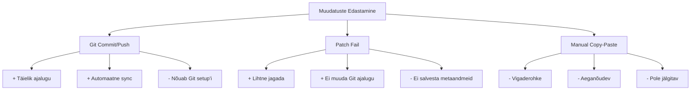

# Git Apply - Praktilised Patch'ide Rakendamise Oskused

!!! tip "Navigeerimine"
    Kasuta paremal olevat sisukorda kiireks navigeerimiseks ↗️

**Eesmärk:** Õppida rakendama muudatusi patch failidest versioonihalduse kontekstis

---

## Mis on Patch ja Miks See Oluline On?

Patch on fail, mis sisaldab muudatuste kirjeldust kahe faili versiooni vahel. See on fundamentaalne versioonihalduse tööriist, mis võimaldab muudatusi täpselt ja kontrollitult edastada.

Praktiline näide: teie kolleeg leiab vea teie koodis ja saadab teile patch faili. Selle asemel, et kopeerida-kleepida koodi käsitsi, saate patch'i automaatselt rakendada.

---

## Patch'ide Roll Versioonihalduses

### Millal Patch'e Kasutatakse

Moodsas arendustöös on patch'id kriitilised järgmistes olukordades:

**Bug fix'ide rakendamine:** Kui tootmises avastatakse kriitiline viga, saab patch'iga kiiresti paranduse rakendada ilma kogu koodi uuesti deployment'ita.

**Code review protsess:** Pärast code review'd saadete tavaliselt nõuded muudatuste tegemiseks. Patch aitab neid muudatusi täpselt implementeerida.

**Meeskonnatöö:** Mitme arendaja vahel muudatuste jagamine ja sünkroniseerimine.

**Eksperimentaalne arendus:** Ajutiste muudatuste testimine ilma Git ajalugu mõjutamata.

### Patch vs Teised Versioonihalduse Meetodid



---

## 1. Patch Failide Süntaks ja Struktuur

### 1.1 Unified Diff Formaat

Patch failid kasutavad unified diff formaati. Iga patch koosneb kolmest osast:

```diff
--- orig_file.py    2023-12-01 10:00:00 +0000
+++ new_file.py     2023-12-01 10:05:00 +0000
@@ -1,3 +1,4 @@
 def calculate_sum(a, b):
-    return a + b
+    result = a + b
+    print(f"Sum: {result}")
+    return result
```

**Struktuuri seletus:**
- `---` rida näitab originaalfaili
- `+++` rida näitab uut faili
- `@@` rida näitab ridade numbrite vahemikku
- `-` märk näitab eemaldatud ridu
- `+` märk näitab lisatud ridu
- Tavaline rida (ilma märgita) jääb muutmata

### 1.2 Konteksti Read

Unified diff sisaldab konteksti ridu (tavaliselt 3 enne ja pärast muudatust), mis aitavad patch'il õiges kohas rakenduda:

```diff
@@ -5,7 +5,8 @@
 def process_data(data):
     if not data:
         return None
-    return data.strip()
+    cleaned = data.strip()
+    return cleaned.lower()
```

---

## 2. Patch'ide Rakendamine

### 2.1 Traditsiooniline `patch` Käsk

Looge testkeskond:

```bash
mkdir patch-practice
cd patch-practice
```

Looge fail `calculator.py`:

```python
def add(a, b):
    return a + b

def subtract(a, b):
    return a - b

if __name__ == "__main__":
    print("Calculator ready")
```

Looge patch fail `calculator.patch`:

```diff
--- calculator.py	2023-12-01 10:00:00 +0000
+++ calculator_improved.py	2023-12-01 10:05:00 +0000
@@ -1,7 +1,12 @@
 def add(a, b):
+    """Add two numbers."""
     return a + b
 
 def subtract(a, b):
+    """Subtract second number from first."""
     return a - b
 
+def multiply(a, b):
+    """Multiply two numbers."""
+    return a * b
+
 if __name__ == "__main__":
-    print("Calculator ready")
+    print("Enhanced calculator ready")
```

Rakendage patch:

```bash
patch calculator.py < calculator.patch
```

Kontrollige tulemust:

```bash
cat calculator.py
```

### 2.2 Git Apply Käsk

Git projektides on `git apply` eelistatud meetod:

```bash
git init
git add calculator.py
git commit -m "Initial calculator"
```

Looge uus patch `feature.patch`:

```diff
--- calculator.py	2023-12-01 10:00:00 +0000
+++ calculator.py	2023-12-01 10:10:00 +0000
@@ -10,5 +10,9 @@
     """Multiply two numbers."""
     return a * b
 
+def divide(a, b):
+    """Divide first number by second."""
+    return a / b if b != 0 else "Error: Division by zero"
+
 if __name__ == "__main__":
     print("Enhanced calculator ready")
```

Rakendage Git'iga:

```bash
git apply feature.patch
```

Erinevus `patch` ja `git apply` vahel:
- `git apply` kontrollib faili olemasolu Git'i index'is
- `git apply` on rangem whitespace'i suhtes
- `git apply` ei muuda faile automaatselt - see ebaõnnestub, kui patch ei sobi

---

## 3. Praktilised Harjutused

### 3.1 Lihtne Bug Fix

Looge fail `temperature.py`:

```python
def celsius_to_fahrenheit(celsius):
    return celsius * 9/5 + 32

def fahrenheit_to_celsius(fahrenheit):
    return (fahrenheit - 32) * 5/9

# Test
print(f"0°C = {celsius_to_fahrenheit(0)}°F")
print(f"32°F = {fahrenheit_to_celsius(32)}°C")
```

Looge patch `temperature_fix.patch`:

```diff
--- temperature.py	2023-12-01 10:00:00 +0000
+++ temperature.py	2023-12-01 10:05:00 +0000
@@ -1,8 +1,12 @@
 def celsius_to_fahrenheit(celsius):
+    if celsius < -273.15:
+        raise ValueError("Temperature below absolute zero")
     return celsius * 9/5 + 32
 
 def fahrenheit_to_celsius(fahrenheit):
+    if fahrenheit < -459.67:
+        raise ValueError("Temperature below absolute zero")
     return (fahrenheit - 32) * 5/9
 
 # Test
-print(f"0°C = {celsius_to_fahrenheit(0)}°F")
-print(f"32°F = {fahrenheit_to_celsius(32)}°C")
+print(f"0°C = {celsius_to_fahrenheit(0):.1f}°F")
+print(f"32°F = {fahrenheit_to_celsius(32):.1f}°C")
```

Rakendage patch ja testige:

```bash
patch temperature.py < temperature_fix.patch
python3 temperature.py
```

### 3.2 Keerukas Muudatus Mitmes Kohas

Looge fail `data_processor.py`:

```python
import json

class DataProcessor:
    def __init__(self):
        self.data = []
    
    def load_data(self, filename):
        with open(filename, 'r') as f:
            self.data = json.load(f)
    
    def process(self):
        return [item.upper() for item in self.data]
```

Looge patch `data_processor_enhancement.patch`:

```diff
--- data_processor.py	2023-12-01 10:00:00 +0000
+++ data_processor.py	2023-12-01 10:10:00 +0000
@@ -1,12 +1,21 @@
 import json
+import logging
 
 class DataProcessor:
     def __init__(self):
         self.data = []
+        self.logger = logging.getLogger(__name__)
     
     def load_data(self, filename):
-        with open(filename, 'r') as f:
-            self.data = json.load(f)
+        try:
+            with open(filename, 'r') as f:
+                self.data = json.load(f)
+                self.logger.info(f"Loaded {len(self.data)} items")
+        except FileNotFoundError:
+            self.logger.error(f"File {filename} not found")
+            self.data = []
     
     def process(self):
-        return [item.upper() for item in self.data]
+        processed = [item.upper() if isinstance(item, str) else str(item).upper() 
+                    for item in self.data]
+        return processed
```

Rakendage ja kontrollige:

```bash
patch data_processor.py < data_processor_enhancement.patch
```

---

## 4. Patch'ide Loomine

### 4.1 Diff Käsk

Looge kaks faili versiooni ja genereerige patch:

```bash
cp calculator.py calculator_original.py
```

Muutke `calculator.py` (lisage kommentaarid):

```python
def add(a, b):
    """Add two numbers together."""
    return a + b

def subtract(a, b):
    """Subtract second number from first."""
    return a - b

if __name__ == "__main__":
    print("Calculator v2.0 ready")
```

Genereerige patch:

```bash
diff -u calculator_original.py calculator.py > my_changes.patch
```

### 4.2 Git Diff

Git projektides:

```bash
# Muudatused staging area's
git diff --cached > staged_changes.patch

# Muudatused working directory's
git diff > working_changes.patch

# Konkreetne commit vs teine
git diff HEAD~1 HEAD > commit_diff.patch
```

---

## 5. Veakäsitlus ja Probleemide Lahendamine

### 5.1 Patch'i Testimine

Enne patch'i rakendamist testige seda:

```bash
git apply --check my_changes.patch
```

Kui väljund on tühi, on patch rakendatav.

### 5.2 Osaliselt Ebaõnnestunud Patch

Kui patch osaliselt ebaõnnestub:

```bash
patch --verbose calculator.py < problematic.patch
```

Vaadake `.rej` faile (reject files):

```bash
cat calculator.py.rej
```

### 5.3 Whitespace Probleemid

Git on tundlik whitespace'i suhtes:

```bash
git apply --ignore-whitespace problematic.patch
```

---

## 6. Täiendavad Võimalused

### 6.1 Reverse Patch

Patch'i tagasivõtmine:

```bash
patch -R calculator.py < calculator.patch
```

### 6.2 Dry Run

Katsetamine ilma muudatusi tegemata:

```bash
patch --dry-run calculator.py < calculator.patch
```

### 6.3 Directory Patch'id

Mitme faili muutmine korraga:

```bash
patch -p1 < multi_file_changes.patch
```

---

## Kokkuvõte ja Järgmised Sammud

### Mida Õppisite

Nüüd oskate:
- Mõista patch failide struktuuri
- Rakendada lihtsaid ja keerukaid muudatusi
- Genereerida oma patch faile
- Käsitleda tavalisi probleeme
- Kasutada patch'e Git workflow'des

### Patch'ide Koht Versioonihalduses

Patch'id on sild kahe Git'i põhikonceptsiooni vahel:
- **Diff'id** näitavad, mis muutus
- **Commit'id** salvestavad muudatused ajalukku

### Järgmised Teemad

Pärast patch'ide valdamist saate süveneda:
- **Git stash** - ajutiste muudatuste salvestamine
- **Git cherry-pick** - konkreetsete commit'ide rakendamine
- **Git rebase** - commit'ide ajaloo ümberkorraldamine
- **Advanced merging** - keerukate konfliktide lahendamine

Patch'ide oskus annab teile parema kontrolli koodi muudatuste üle ja valmistab ette keerukamate versioonihalduse tehnikate õppimiseks.
