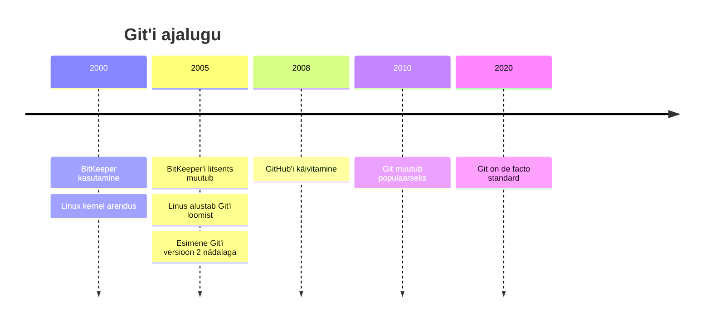
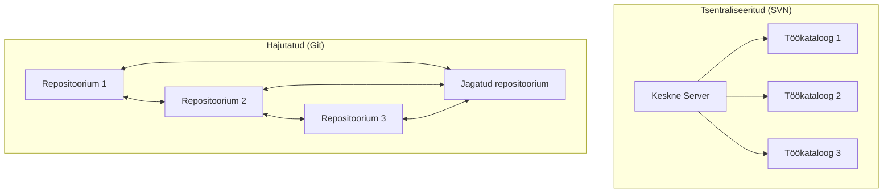
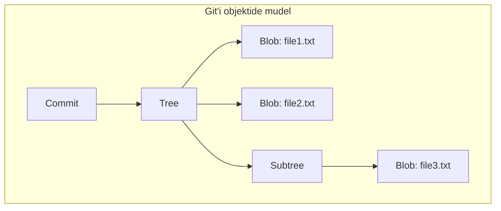
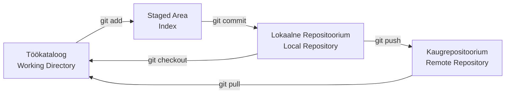

# Git Versioonikontroll

!!! tip "Navigeerimine"
    Kasuta paremal olevat sisukorda kiireks navigeerimiseks ↗️

#### Giti ajalugu ja areng

Git ei tekkinud vaakumis - see lahendas reaalseid probleeme, millega silmitsi seisis Linux kerneli arendustiim 2005. aastal. Linus Torvalds oli aastatega kasutanud erinevaid versioonikontrolli lahendusi, kuid ükski ei vastanud kerneli arenduse kõrgetele nõudmistele. BitKeeper, mida nad kasutasid, muutus äkitselt tasuliseks ning alternatiivid nagu CVS ja Subversion olid liiga aeglased ja tsentraliseeritud.



Giti loomise ajendiks oli vajadus kiire, hajutatud versioonikontrolli järele, mis suudaks käsitleda tuhandeid arendajaid üle maailma. Torvalds lõi Giti kahe nädalaga, keskendudes kolmele põhiprintsiibile: kiirus, lihtne disain ja tugev mittelineaarse arenduse tugi. Need põhimõtted on siiani Giti südames.

Giti hajutatud olemus tähendab, et iga arendaja masinas on täielik koopia repositooriumi ajaloost. See erineb fundamentaalselt tsentraliseeritud süsteemidest nagu SVN, kus üks keskne server hoiab kogu ajalugu.



#### Giti sisemused

Giti geniaalsus peitub selle arhitektuuris. Git kasutab sisu-adresseeritavat salvestust, kus iga faili sisu räsitakse SHA-1 algoritmiga. See räsi muutub faili unikaalseks identifikaatoriks, tagades andmete terviklikkuse ja võimaldades kiiret duplikaatide tuvastamist.



Git kasutab nelja põhilist objekti tüüpi. Blob'id sisaldavad failide sisu, puud (trees) kirjeldavad kataloogi struktuuri, commit'id salvestavad hetktõmmised koos metaandmetega ning tag'id märgistavad olulisi versioonipunkte. Need objektid moodustavad suunatud atsüklilise graafi, mis esitab projekti ajalugu.

Kolmeastmeline arhitektuur - töökataloog, staged area ja repositoorium - annab arendajatele täpse kontrolli selle üle, mida nad commit'ivad.



#### Hargnemisstrateegia

Erinevad tiimid kasutavad erinevaid hargnemisstrateegiaid sõltuvalt oma vajadustest. Git Flow on struktureeritud lähenemine, mis kasutab mitut püsivat haru: master (või main) stabiilsete versioonide jaoks, develop jooksvaks arendustööks, feature harusid uute funktsioonide jaoks ning release ja hotfix harusid spetsiifiliste ülesannete täitmiseks.

```mermaid
gitgraph
    commit id: "Initial"
    branch develop
    checkout develop
    commit id: "Dev work"
    
    branch feature/login
    checkout feature/login
    commit id: "Add login"
    commit id: "Fix login"
    
    checkout develop
    merge feature/login
    commit id: "Integration"
    
    branch release/v1.0
    checkout release/v1.0
    commit id: "Prepare release"
    
    checkout main
    merge release/v1.0
    commit id: "v1.0" tag: "v1.0"
    
    checkout develop
    merge release/v1.0
    
    checkout main
    branch hotfix/critical-bug
    commit id: "Fix critical bug"
    
    checkout main
    merge hotfix/critical-bug
    commit id: "v1.0.1" tag: "v1.0.1"
    
    checkout develop
    merge hotfix/critical-bug
```

GitHub Flow on lihtsam alternatiiv, mis sobib paremini pideva integratsiooni keskkonnas. Selles mudelis on ainult üks main haru, millest luuakse feature harud. Iga feature haru merge'itakse tagasi main'i pärast code review'd.

```mermaid
gitgraph
    commit id: "Initial"
    commit id: "Feature 1"
    
    branch feature/new-component
    checkout feature/new-component
    commit id: "Start component"
    commit id: "Add tests"
    commit id: "Finalize"
    
    checkout main
    merge feature/new-component
    commit id: "Deploy"
    
    branch feature/bug-fix
    checkout feature/bug-fix
    commit id: "Fix bug"
    
    checkout main
    merge feature/bug-fix
    commit id: "Deploy fix"
```

## Lugemisküsimused

Pärast lugemist vasta järgmistele küsimustele oma GitHub repositooriumis failis `git_reading_reflection.md`:

1. **Millise probleemi lahendamiseks Git loodi ja kuidas see erineb tsentraliseeritud versioonikontrolli süsteemidest?**

2. **Selgita Giti nelja objekti tüüpi (blob, tree, commit, tag) ja kuidas need omavahel seotud on.**

3. **Millal kasutaksid Git Flow'd ja millal GitHub Flow'd? Anna konkreetsed näited.**

4. **Kirjelda, mis toimub Giti kolmes etapis: töökataloog → staged area → repositoorium.**

---

## Viited ja lisalugemine

- [Pro Git raamat](https://git-scm.com/book) - põhjalik Git'i käsiraamat
- [Git internals dokumentatsioon](https://git-scm.com/book/en/v2/Git-Internals-Plumbing-and-Porcelain)
- [Atlassian Git tutorials](https://www.atlassian.com/git/tutorials)
- [GitHub Flow guide](https://docs.github.com/en/get-started/quickstart/github-flow)
