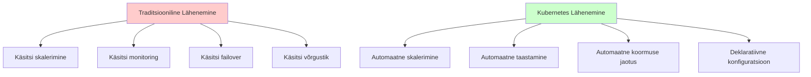
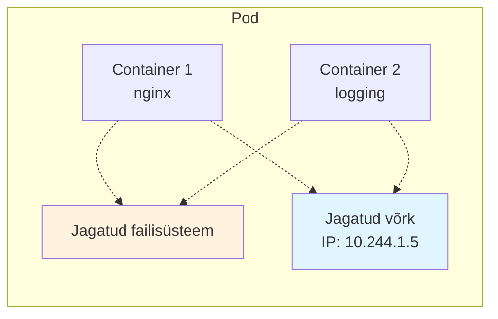
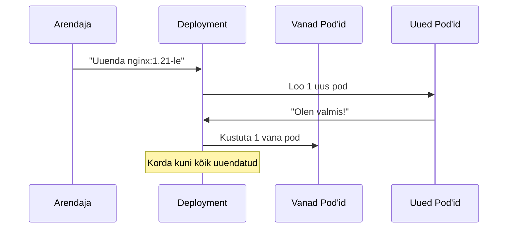
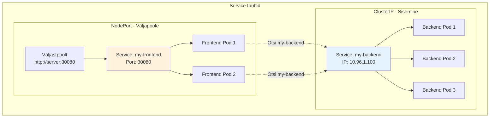
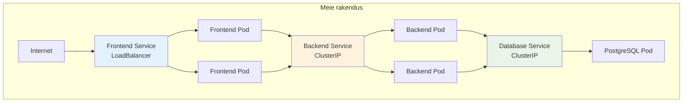
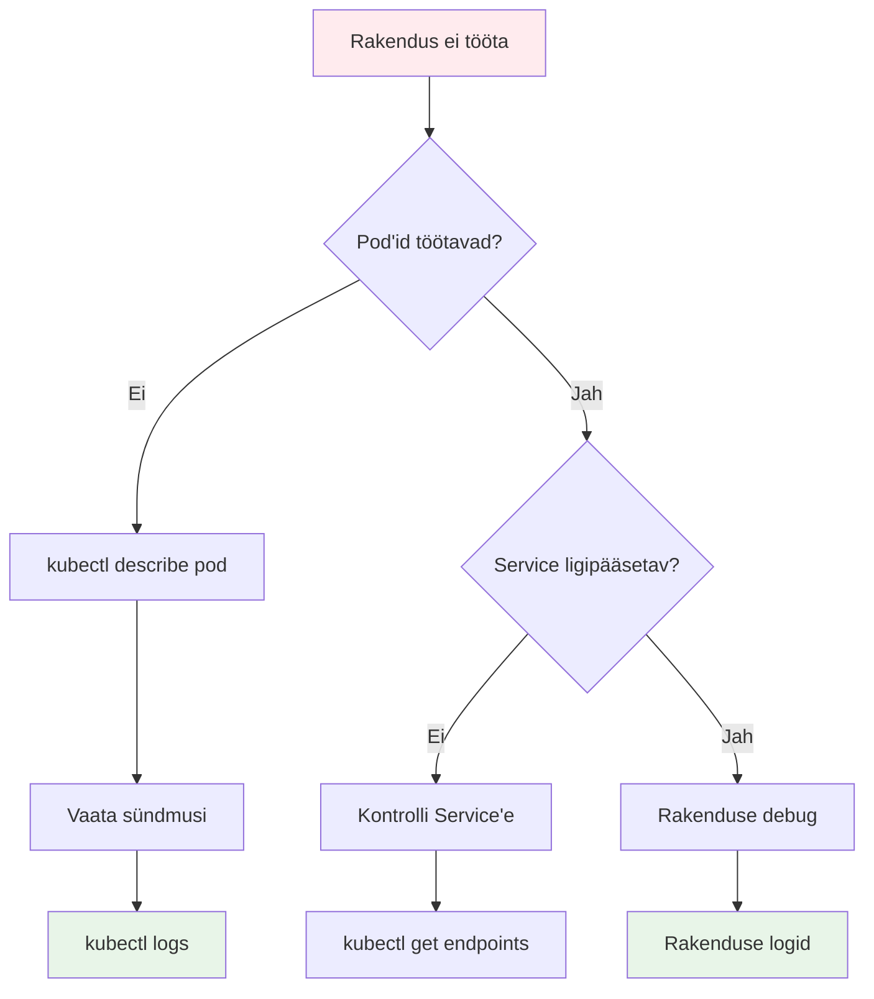
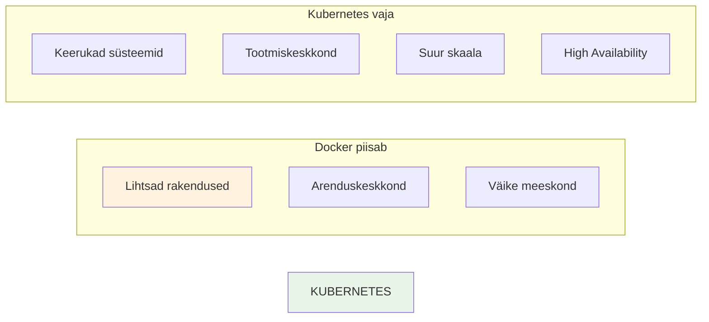

# Kubernetes Põhialused: Container Orchestration

**Eesmärk:** Mõista Kubernetes'i rolli moodsas tarkvaraarenduses ja õppida selle põhifunktsionaalsust


## Sissejuhatus

Tere tulemast Kubernetes'i maailma! Enne kui me sukeldume tehniliste detailide sügavusse, tahaksin teilt küsida: kes on kunagi proovinud käivitada rohkem kui üht Docker konteinerit korraga? Tõstke käsi!

Näete, just siin peitub probleem. Üks kontainer on lihtne. Kaks konteinerit - veel okei. Aga mis juhtub, kui teil on vaja 50 konteinerit? Või 500? Või 5000? Äkki kukub üks kontainer? Kuidas te seda märkate? Kuidas te selle asendage?

Täna õpime tööriista kohta, mis lahendab need probleemid. Aga esmalt - mis see Kubernetes üldse on?

### Kubernetes'i Päritolu ja Tähendus

Kubernetes tuleneb kreeka keelsest sõnast "κυβερνήτης" - kybernētēs. Keegi oskab öelda, mida see tähendab? Täpselt - "roolimees" või "laevajuht". Miks on see oluline? Sest Kubernetes on justnagu laevajuht teie konteinerite laevastikule.

Google lõi selle 2014. aastal oma sisemise Borg süsteemi põhjal. Huvitav fakt: Google on kasutanud konteinerite orkestreerimist juba üle 15 aasta - nad käivitavad umbes 2 miljardit konteinerit nädalas!

## 1. Probleemi Seadmine - Miks Vajame Orkestreerimist?

Ette kujutage, et olete startup'i CTO. Teie rakendus kasvab kiiresti. Eile oli teil 100 kasutajat, täna 10 000. Homme võib olla 100 000. 

Praegu teie arhitektuur näeb välja selline:

```bash
# Üks veebiserver
docker run -d nginx

# Üks andmebaas  
docker run -d postgres

# Üks API server
docker run -d myapi
```

Kõik töötab. Aga mis juhtub kell kolm öösel, kui teie API server kukub? Keegi ei märka enne hommikut. Kasutajad on pahased. Müük langeb.

Või mis juhtub, kui äkki tuleb suur koormus? Teil on vaja kiiresti käivitada 10 API serverit. Käsitsi. Ükshaaval. Stressis.

**Siin tuleb appi Container Orchestration.**



Nüüd küsimus: mis on Container Orchestration? Keegi oskab vastata?

Container Orchestration on nagu dirigent orkestris. Dirigent ei mängi instrumente ise, aga ta koordineerib kõiki muusikuid, et nad mängiks koos harmooniliselt. Samamoodi koordineerib Kubernetes teie konteinereid.

## 2. Kubernetes'i Arhitektuur - Kuidas See Töötab?

Enne kui hakkame käske tippima, peame mõistma, kuidas Kubernetes ehitatud on. See aitab teil hiljem probleeme diagnoosida.

### Control Plane - Klastri "Aju"

Kubernetes koosneb kahest osast. Esimene on Control Plane - klastri "aju". See teeb otsuseid, aga ei käivita teie rakendusi.

```mermaid
graph TB
    subgraph "Control Plane"
        API[API Server<br/>"Sissepääs"]
        ETCD[etcd<br/>"Mälu"]
        SCHED[Scheduler<br/>"Planeerija"]
        CM[Controller Manager<br/>"Jälgija"]
    end
    
    subgraph "Mis iga komponent teeb?"
        API --> A1[Võtab vastu kõik käsud]
        ETCD --> A2[Salvestab kogu oleku]
        SCHED --> A3[Otsustab kuhu pod'id panna]
        CM --> A4[Jälgib ja parandab]
    end
    
    style API fill:#e1f5fe
    style ETCD fill:#fff3e0
    style SCHED fill:#e8f5e8
    style CM fill:#fce4ec
```

Mõelge sellele nagu ettevõtte juhatusele:
- **API Server** on nagu sekretär - kõik päringud lähevad tema kaudu
- **etcd** on nagu ettevõtte andmebaas - hoiab kogu olulist infot
- **Scheduler** on nagu HR - otsustab, kes mida teeb
- **Controller Manager** on nagu juhatuse esimees - jälgib, et kõik läheks plaani järgi

### Worker Node'id - Kus Tegelik Töö Toimub

Teine osa on Worker Node'id. Siin jooksevad teie rakendused.

```mermaid
graph TB
    subgraph "Worker Node"
        KUBELET[kubelet<br/>"Kohalik juht"]
        PROXY[kube-proxy<br/>"Võrguliikluse juht"]
        RUNTIME[Container Runtime<br/>"Konteinerite käivitaja"]
        
        subgraph "Pods"
            POD1[Pod 1]
            POD2[Pod 2]
            POD3[Pod 3]
        end
    end
    
    CP[Control Plane] -.-> KUBELET
    KUBELET --> RUNTIME
    RUNTIME --> POD1
    RUNTIME --> POD2
    RUNTIME --> POD3
    
    PROXY --> POD1
    PROXY --> POD2
    PROXY --> POD3
    
    style KUBELET fill:#e3f2fd
    style PROXY fill:#f3e5f5
    style RUNTIME fill:#e8f5e8
```

- **kubelet** on nagu vahetuse juhataja tehases - täidab control plane'i korraldusi
- **kube-proxy** on nagu postkäitja - toimetab sõnumeid õigesse kohta
- **Container Runtime** on nagu tööline - teeb tegeliku töö

## 3. Kubernetes'i Põhiobjektid - Ehituskivid

Nüüd tuleme huvitava osa juurde. Kubernetes töötab objektidega. Need on nagu LEGO klotsid - igaühel on oma eesmärk.

### Pod - Kõige Väiksem Üksus

Esimene ja kõige olulisem on Pod. Nimi tuleneb inglise keelsest sõnast "pod" - nagu vaalade kari või hernekaunad kaunas.



Miks pole nimi "Container"? Sest pod võib sisaldada mitut konteinerit! Mõelge sellele nagu korterile - tavaliselt elab seal üks perekond, aga võib olla ka kaks.

Oluline: pod'i kõik konteinerid:
- Jagavad sama IP aadressi
- Saavad suhelda localhost kaudu  
- Elavad ja surevad koos

Näitame lihtsat pod'i:

```yaml
apiVersion: v1
kind: Pod
metadata:
  name: nginx-pod
spec:
  containers:
  - name: nginx
    image: nginx:1.20
    ports:
    - containerPort: 80
```

Aga oodate! Ärge kirjutage üksikuid pod'e käsitsi. Miks? Sest kui pod sureb, see ei tule tagasi. Teil on vaja midagi, mis hoolitseb pod'ide eest.

### Deployment - Rakenduse Haldur

Siin tuleb mängu Deployment. See on nagu hea manager - ta hoiab silma peal oma töötajatel (pod'idel).

```mermaid
graph TD
    DEPLOY[Deployment<br/>"Ma tahan 3 nginx pod'i"] --> RS[ReplicaSet<br/>"Ma hoian 3 pod'i töös"]
    RS --> POD1[Pod 1]
    RS --> POD2[Pod 2] 
    RS --> POD3[Pod 3]
    
    POD2 -->|kukub| DEAD[💀]
    RS -->|märkab puudujääki| NEW[Uus Pod 4]
    
    style DEPLOY fill:#e8f5e8
    style RS fill:#fff3e0
    style DEAD fill:#ffebee
    style NEW fill:#e8f5e8
```

Deployment on nutikas:
- Kui pod kukub, loob kohe uue
- Kui tahate skaleerida, muudab pod'ide arvu
- Kui tahate uuendada, teeb seda järk-järgult

```yaml
apiVersion: apps/v1
kind: Deployment
metadata:
  name: nginx-deployment
spec:
  replicas: 3  # Tahan 3 koopiat
  selector:
    matchLabels:
      app: nginx
  template:  # Kuidas pod välja näeb
    metadata:
      labels:
        app: nginx
    spec:
      containers:
      - name: nginx
        image: nginx:1.20
```

Näeme ka rolling update'i toimumist:



### Service - Stabiilne Sissepääs

Aga nüüd on probleem: pod'ide IP aadressid muutuvad! Kuidas teie frontend leiab backend'i?

Vastus on Service. Mõelge sellele nagu ettevõtte peareceptsioonile - kuigi töötajad tulevad ja lähevad, receptsioon on alati samas kohas.



Service teeb kaht asja:
1. Annab stabiilse IP aadressi
2. Jaotab liiklust pod'ide vahel (load balancing)

## 4. Praktiline Näide - Ehitame Rakenduse

Nüüd ehitame koos lihtsa rakenduse. Meil on:
- Frontend (React)
- Backend (Node.js API)  
- Andmebaas (PostgreSQL)



Alustame backend'ist:

```yaml
# Backend Deployment
apiVersion: apps/v1
kind: Deployment
metadata:
  name: backend
spec:
  replicas: 2
  selector:
    matchLabels:
      app: backend
  template:
    metadata:
      labels:
        app: backend
    spec:
      containers:
      - name: backend
        image: myapp/backend:v1.0
        ports:
        - containerPort: 3000
        env:
        - name: DATABASE_URL
          value: "postgresql://postgres:5432/mydb"
```

Kuidas backend leiab andmebaasi? DNS-i kaudu! Kubernetes loob automaatselt DNS kirje `postgres-service` nimega.

## 5. Konfiguratsioon ja Saladused

Aga oodake - me ei saa panna andmebaasi parooli otse YAML faili! See läheb versioonihalduse! Siin tulevad appi ConfigMap ja Secret.

```mermaid
graph TB
    subgraph "Konfiguratsiooni haldamine"
        CM[ConfigMap<br/>"Avalik konfiguratsioon"]
        SECRET[Secret<br/>"Saladused"]
        
        subgraph "Pod"
            CONTAINER[Rakendus]
            ENV[Keskkonnamuutujad]
            FILES[Failid]
        end
        
        CM -->|Seadistused| ENV
        CM -->|Config failid| FILES
        SECRET -->|Paroolid| ENV
        SECRET -->|Sertifikaadid| FILES
    end
    
    style CM fill:#e8f5e8
    style SECRET fill:#ffebee
```

ConfigMap avalikele seadistustele:

```yaml
apiVersion: v1
kind: ConfigMap
metadata:
  name: app-config
data:
  database.host: "postgres-service"
  database.port: "5432"
  api.timeout: "30"
```

Secret saladuste jaoks:

```yaml
apiVersion: v1
kind: Secret
metadata:
  name: app-secret
type: Opaque
data:
  username: cG9zdGdyZXM=  # "postgres" base64 kodeeringus
  password: bXlwYXNzd29yZA==  # "mypassword" base64 kodeeringus
```

## 6. Monitoring ja Probleemide Lahendamine

Mis juhtub, kui midagi läheb valesti? Kubernetes annab meile tööriistad jälgimiseks.



Põhilised debug käsud:

```bash
# Vaata pod'ide olekut
kubectl get pods

# Detailne info probleemse pod'i kohta
kubectl describe pod <pod-name>

# Vaata logisid
kubectl logs <pod-name> -f

# Mine pod'i sisse
kubectl exec -it <pod-name> -- /bin/bash

# Vaata service'eid
kubectl get services
kubectl get endpoints
```

## 7. Millal Kasutada Kubernetes'i?

Nüüd küsimus: millal peaksite Kubernetes'i kasutama?



**Kubernetes sobib kui:**
- Teil on rohkem kui 10-20 konteinerit
- Vajate automaatset skaleerimist
- Downtime on kulukas
- Meeskond oskab Kubernetes'i

**Docker Compose piisab kui:**
- Lihtne rakendus
- Arenduskeskkond
- Väike meeskond
- Ressursside kokkuhoid on oluline

## Kokkuvõte ja Järgmised Sammud

Mis me täna õppisime?

1. **Kubernetes lahendab konteinerite orkestreerimise probleeme**
2. **Control Plane teeb otsuseid, Worker Node'id teevad tööd**
3. **Pod'id, Deployment'id ja Service'id on põhiehituskivid**
4. **ConfigMap ja Secret hoiavad konfiguratsiooni turvaliselt**
5. **Monitoring ja debugging on kriitilised oskused**

Teie kodutööks: installige Minikube ja proovige täna näidatud näiteid. Järgmises tunnis teeme praktilist lab'i - deploy'ime päris rakenduse!

Küsimused?

---

## Viited ja Dokumentatsioon

### Ametlik Dokumentatsioon
- [Kubernetes Official Documentation](https://kubernetes.io/docs/) - põhiline dokumentatsioon
- [kubectl Reference](https://kubernetes.io/docs/reference/kubectl/) - käskude справочник
- [Kubernetes API Reference](https://kubernetes.io/docs/reference/kubernetes-api/) - API dokumentatsioon

### Õppematerjalid
- [Kubernetes Basics Tutorial](https://kubernetes.io/docs/tutorials/kubernetes-basics/) - interaktiivne õpetus
- [CNCF Kubernetes Fundamentals](https://www.cncf.io/certification/training/) - ametlik koolitus

### Praktilised Tööriistad
- [Minikube](https://minikube.sigs.k8s.io/docs/) - kohalik Kubernetes
- [kubectl Cheat Sheet](https://kubernetes.io/docs/reference/kubectl/cheatsheet/) - kasulikud käsud