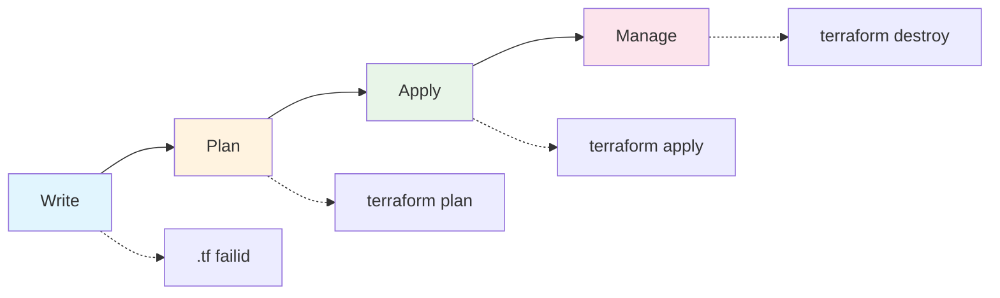
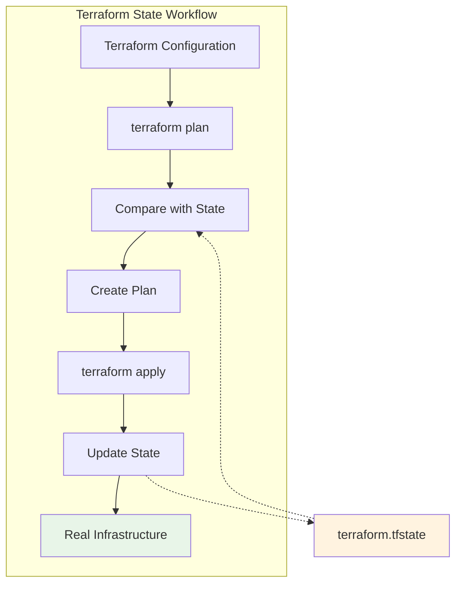

# Terraform Basics: Infrastructure as Code

**Eesmärk:** Mõista Infrastructure as Code kontseptsiooni ja õppida Terraform'i põhialused

---

## Sissejuhatus - Miks me vajame Infrastructure as Code?

Tere tulemast infrastruktuuri maailma! Eelmisel nädalal õppisime Kubernetes'i - kuidas orkesteerida konteinereid. Täna astume järgmisele tasemele ja vaatame, kuidas hallata kogu infrastruktuuri koodi abil.

Kujutage ette stsenaariumi: teil on vaja seadistada uus arenduskeskkond. Traditsioonilise lähenemisega tähendaks see:

**Traditsiooniline lähenemine:**
- Käsitsi serverite tellimine
- Käsitsi operatsioonisüsteemi installeerimine  
- Käsitsi tarkvara seadistamine
- Käsitsi võrgu konfigureerimine
- Käsitsi turvaseadete rakendamine

Iga samm võtab aega, on altid vigadele ja raske korrata. Mis juhtub, kui peate seadistama teise keskkonna? Või kolmanda?

```mermaid
graph TB
    subgraph "Traditsiooniline Lähenemine"
        A[Käsitsi serverite tellimine] --> B[Käsitsi OS installeerimine]
        B --> C[Käsitsi tarkvara paigaldamine]
        C --> D[Käsitsi võrgu seadistamine]
        D --> E[Käsitsi turvaseadete rakendamine]
        E --> F[Aeglane ja vigadealane protsess]
    end
    
    subgraph "Infrastructure as Code"
        G[Kirjuta kood] --> H[Käivita terraform apply]
        H --> I[Automatiseeritud loomine]
        I --> J[Konsistentne ja kiire]
    end
    
    style F fill:#ffcccc
    style J fill:#ccffcc
```



**Infrastructure as Code muudab mängu:**
- Kirjutate koodi, mis kirjeldab soovitud infrastruktuuri
- Käivitate käsu, mis loob selle teie eest
- Sama kood töötab igal kord
- Versioonihaldusse saab panna
- Saab testida ja üle vaadata

### Mis on Infrastructure as Code?

Infrastructure as Code (IaC) tähendab infrastruktuuri kirjeldamist ja haldamist koodi abil, mitte käsitsi konfiguratsioonide kaudu.

Mõelge sellele nagu retseptile:
- **Traditsiooniline:** "Ütlen sulle, kuidas kooki teha"
- **IaC:** "Siin on retsept, järgi seda"

IaC eelised:
- **Konsistentsus** - sama tulemus iga kord
- **Kiirus** - automatiseeritud protsess
- **Dokumentatsioon** - kood ise on dokumentatsioon
- **Versioonihaldus** - saab kasutada Git'i
- **Testimine** - saab testida enne rakendamist

---

## 1. Terraform Sissejuhatus

### Mis on Terraform?

Terraform on HashiCorp'i loodud Infrastructure as Code tööriist. See võimaldab teil kirjeldada infrastruktuuri deklaratiivses keeles nimega HCL (HashiCorp Configuration Language).

**Terraform vs teised tööriistad:**

| Tööriist | Lähenemine | Keeled | Tugevused |
|----------|------------|--------|-----------|
| **Terraform** | Deklaratiivne | HCL | Multi-cloud, rikas ökosüsteem |
| **Ansible** | Protseduuriline | YAML | Lihtne õppida, agentless |
| **Pulumi** | Imperatiivne | Python, Go, etc | Programmeerimiskeelte võimsus |

**Miks Terraform?**
- **Multi-provider** - töötab AWS, Azure, Google Cloud, kohalikult
- **Deklaratiivne** - kirjeldate mida tahate, mitte kuidas
- **State management** - teab, mis on juba olemas
- **Plan and apply** - näitab ette, mida teeb

### Terraform Workflow



**1. Write** - kirjutate HCL konfiguratsioonifailid
**2. Plan** - Terraform näitab, mida kavatseb teha
**3. Apply** - Terraform teeb muudatused
**4. Manage** - Terraform jälgib ja haldab ressursse

---

## 2. HCL Keel ja Süntaks

### HashiCorp Configuration Language

HCL on spetsiaalselt infrastruktuuri kirjeldamiseks loodud keel. See on JSON-i sarnane, kuid loetavam ja võimsam.

### Põhilised HCL Blokid

**Resource Block - ressursi definitsioon:**

```hcl
resource "local_file" "example" {
  content  = "Hello, Terraform!"
  filename = "hello.txt"
}
```

See loob kohaliku faili nimega "hello.txt" sisuga "Hello, Terraform!".

**Variable Block - muutujad:**

```hcl
variable "file_name" {
  description = "Name of the file to create"
  type        = string
  default     = "hello.txt"
}

variable "environment" {
  description = "Environment name"
  type        = string
  validation {
    condition     = contains(["dev", "staging", "prod"], var.environment)
    error_message = "Environment must be dev, staging, or prod."
  }
}
```

**Output Block - väljundid:**

```hcl
output "file_path" {
  description = "Path to the created file"
  value       = local_file.example.filename
}
```

**Data Source - andmete lugemine:**

```hcl
data "local_file" "config" {
  filename = "config.txt"
}

# Kasutamine
resource "local_file" "processed" {
  content  = "Processed: ${data.local_file.config.content}"
  filename = "processed.txt"
}
```

### Andmetüübid ja Funktsioonid

**Andmetüübid:**

```hcl
# String
variable "name" {
  type    = string
  default = "my-server"
}

# Number
variable "port" {
  type    = number
  default = 80
}

# Boolean
variable "enable_ssl" {
  type    = bool
  default = true
}

# List
variable "allowed_ports" {
  type    = list(number)
  default = [80, 443, 22]
}

# Map
variable "tags" {
  type = map(string)
  default = {
    Environment = "dev"
    Project     = "web-app"
  }
}
```

**Funktsioonid ja avaldised:**

```hcl
locals {
  # String interpolation
  full_name = "${var.project_name}-${var.environment}"
  
  # Conditional expression
  instance_type = var.environment == "prod" ? "large" : "small"
  
  # Functions
  config_json = jsonencode({
    name = var.project_name
    ports = var.allowed_ports
  })
}
```

---

## 3. Providers ja Ressursid

### Mis on Provider?

Provider on plugin, mis võimaldab Terraform'il suhelda erinevate teenustega. Mõelge sellele kui "tõlkijale" - see tõlgib Terraform'i käsud konkreetse teenuse API kõnedeks.

**Provider konfiguratsioon:**

```hcl
terraform {
  required_providers {
    local = {
      source  = "hashicorp/local"
      version = "~> 2.0"
    }
  }
}
```

### Local Provider Näited

Alustame kohaliku provider'iga, mis ei vaja cloud'i:

**Lihtsa faili loomine:**

```hcl
resource "local_file" "web_config" {
  content  = "Server configuration for web application"
  filename = "${path.module}/config/web.conf"
}
```

**Kataloogi loomine:**

```hcl
resource "local_file" "logs_dir" {
  content  = ""
  filename = "${path.module}/logs/.gitkeep"
}
```

**Konfiguratsioonifaili loomine JSON'iga:**

```hcl
resource "local_file" "app_config" {
  content = jsonencode({
    app_name = "my-web-app"
    version  = "1.0.0"
    database = {
      host = "localhost"
      port = 5432
      name = "myapp"
    }
    features = {
      ssl_enabled     = true
      debug_mode      = false
      max_connections = 100
    }
  })
  filename = "${path.module}/config/app.json"
}
```

**Template'ide kasutamine:**

```hcl
resource "local_file" "nginx_config" {
  content = templatefile("${path.module}/templates/nginx.conf.tpl", {
    server_name = var.server_name
    port        = var.port
    ssl_enabled = var.ssl_enabled
  })
  filename = "${path.module}/config/nginx.conf"
}
```

### Ressursside Sõltuvused

**Automaatsed sõltuvused:**

```hcl
resource "local_file" "database_config" {
  content = jsonencode({
    host = "db.example.com"
    port = 5432
  })
  filename = "${path.module}/config/database.json"
}

resource "local_file" "app_config" {
  content = templatefile("${path.module}/templates/app.conf.tpl", {
    database_config = local_file.database_config.filename
  })
  filename = "${path.module}/config/app.conf"
}
```

**Explicit sõltuvused:**

```hcl
resource "local_file" "readme" {
  content  = "Application documentation"
  filename = "${path.module}/README.md"
  
  depends_on = [
    local_file.app_config,
    local_file.database_config
  ]
}
```

### Lifecycle Rules

```hcl
resource "local_file" "important_config" {
  content  = var.config_content
  filename = "${path.module}/config/important.conf"
  
  lifecycle {
    prevent_destroy = true
    ignore_changes  = [content]
    create_before_destroy = true
  }
}
```

---

## 4. State Management

### Mis on Terraform State?

Terraform state on andmebaas, mis sisaldab teavet teie infrastruktuuri kohta. See on Terraform'i "mälu" - kuidas ta teab, mis ressursid on olemas ja kuidas neid hallata.



**State fail sisaldab:**
- Ressursside ID-d ja metaandmeid
- Sõltuvuste graafi
- Providerite informatsiooni
- Ressursside praegust olekut

**State faili näide:**

```json
{
  "version": 4,
  "terraform_version": "1.6.0",
  "resources": [
    {
      "mode": "managed",
      "type": "local_file",
      "name": "example",
      "instances": [
        {
          "attributes": {
            "content": "Hello, Terraform!",
            "filename": "hello.txt",
            "id": "4b5d1e7c8f9a2b3c"
          }
        }
      ]
    }
  ]
}
```

### State'i Parimad Praktikad

**1. Remote State kasutamine:**

```hcl
terraform {
  backend "s3" {
    bucket = "my-terraform-state"
    key    = "web-app/terraform.tfstate"
    region = "us-west-2"
  }
}
```

**2. State Locking:**

```hcl
terraform {
  backend "s3" {
    bucket         = "my-terraform-state"
    key            = "web-app/terraform.tfstate"
    region         = "us-west-2"
    dynamodb_table = "terraform-locks"
  }
}
```

**3. Sensitive andmete käsitlemine:**

```hcl
variable "database_password" {
  description = "Database password"
  type        = string
  sensitive   = true
}

output "database_password" {
  value     = var.database_password
  sensitive = true
}
```

### State'i Haldamise Käsud

```bash
# State'i info vaatamine
terraform state list
terraform state show local_file.example

# Ressursi liigutamine
terraform state mv local_file.old local_file.new

# Ressursi eemaldamine state'ist
terraform state rm local_file.example

# Olemasoleva ressursi import
terraform import local_file.example hello.txt

# State'i värskendamine
terraform refresh
```

---

## 5. Praktilised Näited

### Lihtne Web Rakenduse Infrastruktuur

Loome kohaliku arenduskeskkonna failide struktuuri:

```hcl
# variables.tf
variable "project_name" {
  description = "Name of the project"
  type        = string
  default     = "web-app"
}

variable "environment" {
  description = "Environment (dev, staging, prod)"
  type        = string
  default     = "dev"
}

# main.tf
terraform {
  required_providers {
    local = {
      source  = "hashicorp/local"
      version = "~> 2.0"
    }
  }
}

# Project structure
resource "local_file" "project_structure" {
  for_each = toset([
    "src/",
    "config/",
    "scripts/",
    "docs/"
  ])
  
  content  = ""
  filename = "${path.module}/${var.project_name}/${each.key}/.gitkeep"
}

# Application configuration
resource "local_file" "app_config" {
  content = jsonencode({
    name        = var.project_name
    environment = var.environment
    version     = "1.0.0"
    database = {
      host = "localhost"
      port = 5432
      name = "${var.project_name}_${var.environment}"
    }
    cache = {
      provider = "redis"
      host     = "localhost"
      port     = 6379
    }
    logging = {
      level = var.environment == "prod" ? "warn" : "debug"
      file  = "/var/log/${var.project_name}.log"
    }
  })
  filename = "${path.module}/${var.project_name}/config/app.json"
}

# Environment-specific configuration
resource "local_file" "env_config" {
  content = templatefile("${path.module}/templates/env.tpl", {
    project_name = var.project_name
    environment  = var.environment
    debug_mode   = var.environment != "prod"
  })
  filename = "${path.module}/${var.project_name}/.env.${var.environment}"
}

# Docker Compose file
resource "local_file" "docker_compose" {
  content = templatefile("${path.module}/templates/docker-compose.yml.tpl", {
    project_name = var.project_name
    environment  = var.environment
  })
  filename = "${path.module}/${var.project_name}/docker-compose.yml"
}

# outputs.tf
output "project_path" {
  description = "Path to the project directory"
  value       = "${path.module}/${var.project_name}"
}

output "config_files" {
  description = "List of created configuration files"
  value = [
    local_file.app_config.filename,
    local_file.env_config.filename,
    local_file.docker_compose.filename
  ]
}
```

**Template failid:**

```yaml
# templates/docker-compose.yml.tpl
version: '3.8'
services:
  app:
    build: .
    ports:
      - "3000:3000"
    environment:
      - NODE_ENV=${environment}
      - PROJECT_NAME=${project_name}
    volumes:
      - ./src:/app/src
      
  database:
    image: postgres:13
    environment:
      - POSTGRES_DB=${project_name}_${environment}
      - POSTGRES_USER=app_user
      - POSTGRES_PASSWORD=development_password
    ports:
      - "5432:5432"
```

### For_each ja Count kasutamine

```hcl
# Multiple environments
variable "environments" {
  type = map(object({
    debug_enabled = bool
    replicas     = number
  }))
  default = {
    dev = {
      debug_enabled = true
      replicas     = 1
    }
    staging = {
      debug_enabled = false
      replicas     = 2
    }
    prod = {
      debug_enabled = false
      replicas     = 3
    }
  }
}

resource "local_file" "env_configs" {
  for_each = var.environments
  
  content = jsonencode({
    environment   = each.key
    debug_enabled = each.value.debug_enabled
    replicas      = each.value.replicas
    timestamp     = timestamp()
  })
  filename = "${path.module}/configs/${each.key}.json"
}

# Conditional resource creation
resource "local_file" "debug_config" {
  count = var.environment == "dev" ? 1 : 0
  
  content  = "Debug configuration for development"
  filename = "${path.module}/debug.conf"
}
```

---

## 6. Terraform Käsud ja Workflow

### Põhilised Terraform Käsud

```bash
# Projekti initsialiseerimine
terraform init

# Konfiguratsiooni valideerimine
terraform validate

# Formattimine
terraform fmt

# Planeerimine (kuiv käivitus)
terraform plan

# Rakendamine
terraform apply

# Ressursside kustutamine
terraform destroy

# State'i haldamine
terraform state list
terraform state show resource_name
```

### Terraform Workflow Näide

```bash
# 1. Loo uus Terraform projekt
mkdir my-terraform-project
cd my-terraform-project

# 2. Loo main.tf fail
cat > main.tf << EOF
terraform {
  required_providers {
    local = {
      source  = "hashicorp/local"
      version = "~> 2.0"
    }
  }
}

resource "local_file" "hello" {
  content  = "Hello from Terraform!"
  filename = "hello.txt"
}
EOF

# 3. Initialiseeri projekt
terraform init

# 4. Valideeri konfiguratsioon
terraform validate

# 5. Planeeri muudatused
terraform plan

# 6. Rakenda muudatused
terraform apply

# 7. Kontrolli tulemust
cat hello.txt

# 8. Kustuta ressursid
terraform destroy
```

---

## Kokkuvõte ja Järgmised Sammud

### Mida õppisime täna?

1. **Infrastructure as Code kontseptsiooni** - miks infrastruktuuri koodina haldamine on kasulik
2. **Terraform'i põhialused** - kuidas see töötab ja miks seda kasutada
3. **HCL süntaksi** - resources, variables, outputs, data sources
4. **Provider'ite kasutamist** - kuidas erinevate teenustega suhelda
5. **State management'i** - kuidas Terraform jälgib infrastruktuuri

### Järgmises laboris

Teeme praktilisi harjutusi:
- Loome kohaliku arenduskeskkonna
- Kasutame muutujaid ja template'e
- Harjutame state'i haldamist
- Töötame meeskonnaga

### Parimad Praktikad

**1. Kood organisatsioon:**
- Kasutage mooduleid
- Eraldage keskkonnad
- Järgige nimede konventsioone

**2. State'i turvalisus:**
- Kasutage remote state'i
- Lubage state locking
- Käsitlege sensitive andmeid õigesti

**3. Meeskonnatöö:**
- Kasutage versioonihalust
- Tehke code review'd
- Dokumenteerige muudatused

Infrastructure as Code ei ole ainult tööriist - see on mõtteviis. See muudab infrastruktuuri haldamise reproducible, scalable ja maintainable protsessiks.

**Järgmises osas** teeme praktilist tööd - deploy'ime tervikliku arenduskeskkonna Terraform'iga!

---

## Viited ja Dokumentatsioon

### Ametlik Dokumentatsioon
- [Terraform Official Documentation](https://www.terraform.io/docs) - täielik dokumentatsioon
- [HCL Language Guide](https://www.terraform.io/docs/language) - HCL süntaksi juhend
- [Terraform Registry](https://registry.terraform.io/) - provider'id ja moodulid

### Provider'ite Dokumentatsioon
- [Local Provider](https://registry.terraform.io/providers/hashicorp/local/latest/docs) - kohalike ressursside haldamine
- [Random Provider](https://registry.terraform.io/providers/hashicorp/random/latest/docs) - juhuslike väärtuste genereerimine

### Best Practices
- [Terraform Best Practices](https://www.terraform.io/docs/cloud/guides/recommended-practices) - soovitatud praktikad
- [Terraform Style Guide](https://www.terraform.io/docs/language/syntax/style) - koodi stiili juhend